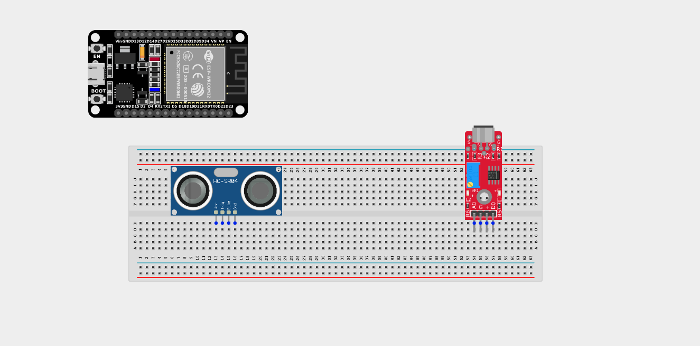
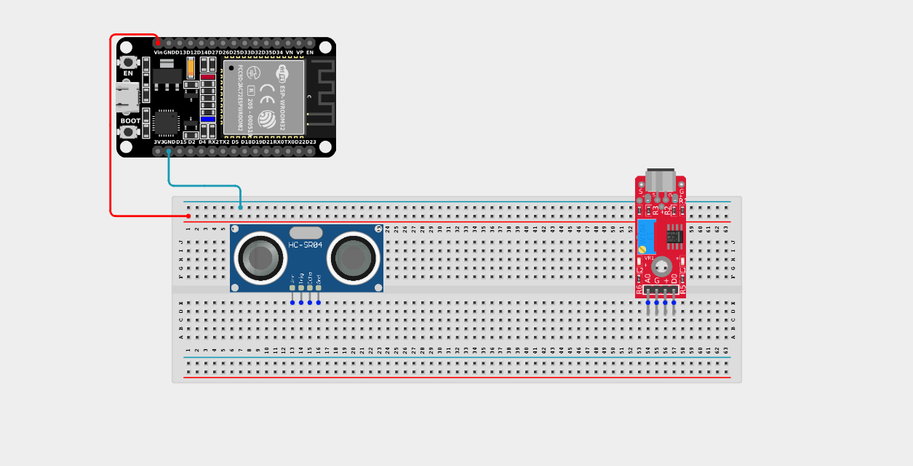
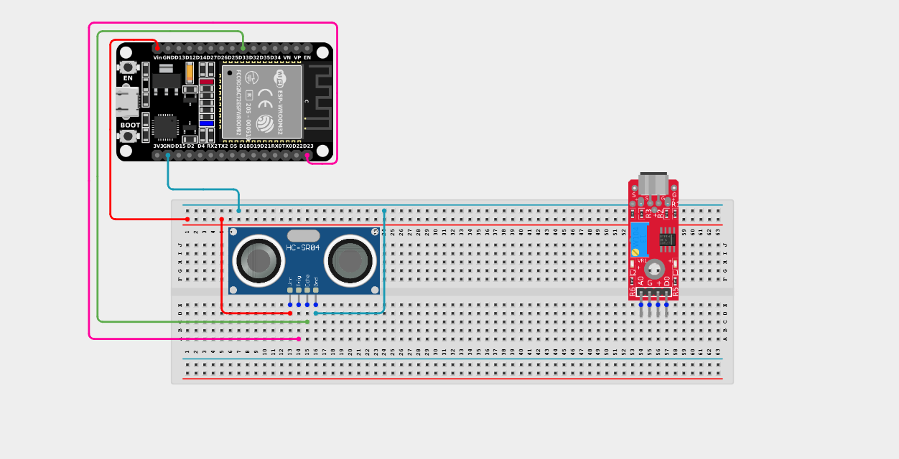
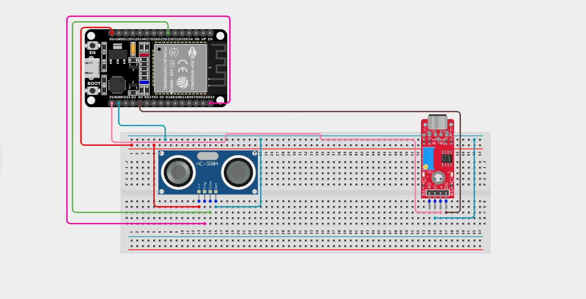

# Project 2.7.7: Multi-Factor Tracker

| **Description** | This project measures both proximity (ultrasonic) and sound levels simultaneously to log environmental events with multiple sensor inputs. |
|------------------|----------------------------------------------------------------|
| **Use case**     | Used in high-end security systems that require a combination of inputs (e.g. motion AND breaking glass) to trigger an alarm, preventing false positives. |

## Components (Things You will need)

|  |  |  |  |  |  |
| --- | --- | --- | --- | --- | --- |

## Building the circuit

> **Tip:** Use the [ESP32 Pin Mapping](../../../../assets/esp32_pin_mapping.png) image to locate the correct GPIO pins on your ESP32 board.

Things Needed:

- ESP32 board = 1

- Micro USB cable = 1

- Breadboard = 1

- Jumper wires 

- Ultrasonic sensor = 1

- Sound sensor module = 1

---

## Mounting the components on the breadboard

**Step 1:** Mount the ESP32 and Components:

- Align the ESP32 board across the center dividing ridge of the breadboard.

- Insert the Ultrasonic Sensor so its four pins (VCC, TRIG, ECHO, GND) sit in separate adjacent rows.

- Insert the Sound Sensor Module so its pins sit in separate adjacent rows.



---

## Wiring the circuit

Follow these step-by-step connection details using your jumper wires:

**Step 1:** Create Power and Ground Rails

- Connect the **5V** or **VIN** pin on the ESP32 board to the positive (red) rail on the breadboard.

- Connect a **GND** pin on the ESP32 board to the negative (blue/black) rail on the breadboard.


**Step 2:** Wire the Ultrasonic Sensor

- Connect the **VCC** pin of the Ultrasonic sensor to the positive 5V power rail.

- Connect the **GND** pin of the Ultrasonic sensor to the negative ground rail.

- Connect the **TRIG** pin of the sensor to **GPIO 23** on the ESP32 board.

- Connect the **ECHO** pin of the sensor to **GPIO 33** on the ESP32 board.



**Step 3:** Wire the Sound Sensor

- Connect the **+ / VCC** pin of the sound sensor to the 3.3V pin on the ESP32 board (or 3.3V power rail).

- Connect the **G** pin of the sound sensor to the negative ground rail.

- Connect the **DO (Digital Out)** pin of the sound sensor to **GPIO 4** on the ESP32 board.





*Make sure to connect the Micro USB cable securely to the ESP32 board and your computer.*

---

## PROGRAMMING

**Step 1:** Open your Arduino IDE. See how to set up here: [Getting Started](../../Getting Started/Arduino_IDE_Setup.md).

**Step 2:** Write the code in sections as detailed below.

### 1. Variables and Setup

```cpp
const int trigPin = 23;
const int echoPin = 33;
const int soundPin = 4;

long duration;
float distance;

void setup() {
  Serial.begin(9600);
  
  pinMode(trigPin, OUTPUT);
  pinMode(echoPin, INPUT);
  pinMode(soundPin, INPUT);
  
  Serial.println("Multi-Factor Logging Started...");
}
```
*Explanation:* We declare our ultrasonic pins and our digital sound pin. Because both sensors just require standard `INPUT` / `OUTPUT` commands, the setup is very straightforward!

---

### 2. Main Loop

```cpp
void loop() {
  // 1. Measure Distance
  digitalWrite(trigPin, LOW);
  delayMicroseconds(2);
  digitalWrite(trigPin, HIGH);
  delayMicroseconds(10);
  digitalWrite(trigPin, LOW);
  
  duration = pulseIn(echoPin, HIGH);
  distance = duration * 0.0343 / 2;
  
  // 2. Read Sound State (LOW usually means sound detected)
  bool soundDetected = (digitalRead(soundPin) == LOW);
  
  // 3. Print a unified log line!
  Serial.print("Proximity: ");
  Serial.print(distance);
  Serial.print(" cm  |  Noise Level: ");
  
  if (soundDetected) {
    Serial.println("LOUD!");
  } else {
    Serial.println("Quiet.");
  }
  
  // Wait before next reading
  delay(500); 
}
```
*Explanation:* 

- We read data from *both* sensors sequentially in the same loop. 

- We measure the exact distance with the ultrasonic sensor.

- We check the binary state of the sound sensor (`LOW` = loud noise detected).

- We combine both pieces of data into a single, clean log line in the Serial Monitor. This allows you to look for correlations (e.g. "Whenever the distance drops below 10cm, a loud noise is detected immediately after").

---

## Uploading the code

**Step 3:** Save your code. _See the [Getting Started](../../Getting Started/Arduino_IDE_Setup.md) section_

**Step 4:** Select the ESP32 board and port _See the [Getting Started](../../Getting Started/Arduino_IDE_Setup.md) section:Selecting ESP32 board Type and Uploading your code_.

**Step 5:** Upload your code. _See the [Getting Started](../../Getting Started/Arduino_IDE_Setup.md) section:Selecting ESP32 board Type and Uploading your code_

## Conclusion

This project helps you understand how you can continuously poll and combine data streams from completely different physical domains (sound waves vs ultrasonic echoes) into a unified logging and analytics system!
