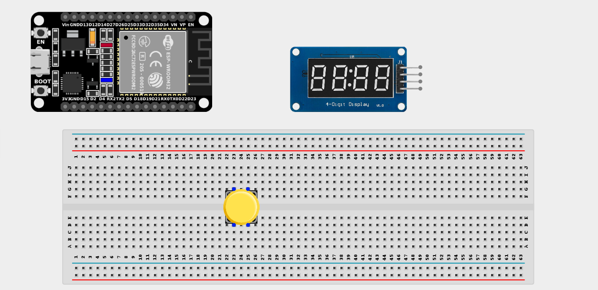
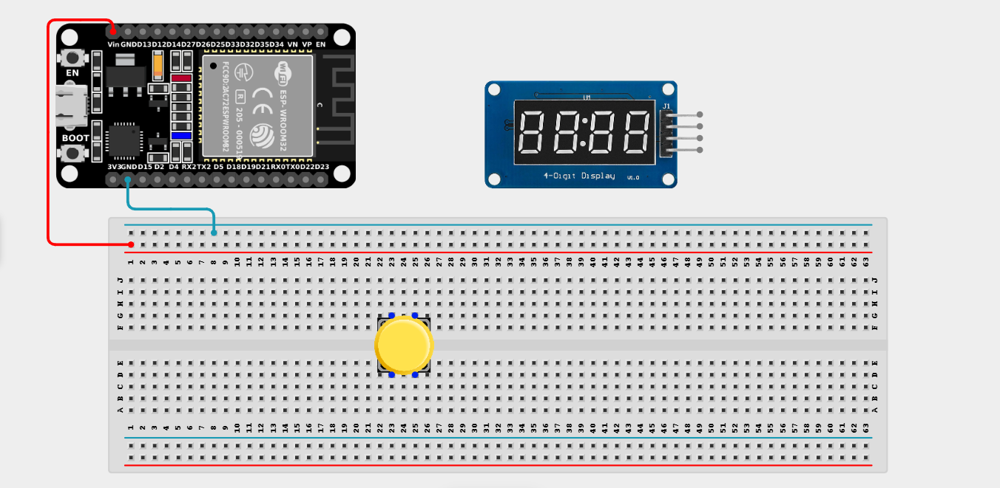
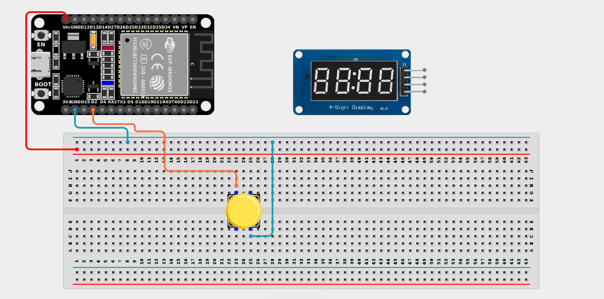
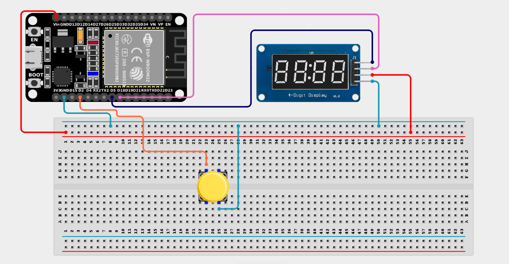

# Project 2.8: Smart Queue Management System

| **Description** | This project simulates a customer queue system using a push button and a 4-digit display. Each button press issues the next queue number sequentially. |
|------------------|----------------------------------------------------------------|
| **Use case**     | This project is connected to real-world uses such as queue systems widely used in hospitals, banks, government offices, and customer service centers. |

## Components (Things You will need)

|  |  |  |  |  |  |
| --- | --- | --- | --- | --- | --- |

## Building the circuit

> **Tip:** Use the [ESP32 Pin Mapping](../../assets/esp32_pin_mapping.png) image to locate the correct GPIO pins on your ESP32 board.

Things Needed:

- ESP32 board = 1

- Micro USB cable = 1

- Breadboard = 1

- Jumper Wires

- Push Button = 1

- TM1637 4-Digit Display = 1

---

## Mounting the components on the breadboard

**Step 1:** Mount the ESP32 and Push Button:

- Align the ESP32 board across the center dividing ridge of the breadboard.

- Place the Push Button firmly across the center gap of the breadboard.

- (Connect the 4-Digit Display using jumper wires).



---

## Wiring the circuit

Follow these step-by-step connection details using your jumper wires:

**Step 1:** Create Power and Ground Rails

- Connect the **5V** or **VIN** pin on the ESP32 board to the positive (red) rail on the breadboard.

- Connect a **GND** pin on the ESP32 board to the negative (blue/black) rail on the breadboard.




**Step 2:** Wire the Push Button

- Connect one terminal (leg) of the push button to **GPIO 2** on the ESP32 board.

- Connect the opposite terminal of the push button to the **GND (negative)** rail on the breadboard. *(We will use the internal pull-up resistor in code).*



**Step 3:** Wire the TM1637 4-Digit Display

- Connect **VCC** of the display to the positive power rail.

- Connect **GND** of the display to the negative power rail.

- Connect **CLK** (Clock) of the display to **GPIO 5** on the ESP32 board.

- Connect **DIO** (Data I/O) of the display to **GPIO 18** on the ESP32 board.



*Make sure to connect the Micro USB cable securely to the ESP32 board and your computer.*

---

## PROGRAMMING

**Step 1:** Open your Arduino IDE. See how to set up here: [Getting Started](../Getting Started/Arduino_IDE_Setup.md).

*(Note: You will need to install the `TM1637` library by Smarthon or Avishorp from the Arduino Library Manager).*

**Step 2:** Write the code in sections as detailed below.

### 1. Library Inclusion and Object Setup

```cpp
#include <TM1637Display.h>

// Define pins for the 4-digit display (CLK, DIO)
const int CLK = 5;
const int DIO = 18;

TM1637Display display(CLK, DIO);

const int buttonPin = 2;
int queueNumber = 0;
```
*Explanation:* We include the `TM1637Display` library. We initialize our `display` object with the `CLK` (5) and `DIO` (18) pins. We define `buttonPin` as 2 and create a `queueNumber` variable to keep track of the customer line, starting at 0.

---

### 2. Setup Function

```cpp
void setup() {
  // Use INPUT_PULLUP so the button reads HIGH when not pressed, and LOW when pressed
  pinMode(buttonPin, INPUT_PULLUP);
  
  // Set the brightness of the display (0 to 7)
  display.setBrightness(0x0f); 
  
  // Show the initial number (0)
  display.showNumberDec(queueNumber);
}
```
*Explanation:* `pinMode(buttonPin, INPUT_PULLUP)` is crucial because it activates the ESP32's internal resistor, saving us from wiring a physical one. The display brightness is set to maximum (`0x0f`), and we show the starting `queueNumber`.

---

### 3. Loop Function

```cpp
void loop() {
  // Check if the button is pressed (LOW because of INPUT_PULLUP)
  if (digitalRead(buttonPin) == LOW) {
    queueNumber++; // Increment the queue number by 1
    
    // Display the new number
    display.showNumberDec(queueNumber);
    
    // Simple debounce delay to prevent one press from counting as multiple
    delay(300); 
  }
}
```
*Explanation:* 

- The `if` statement checks if the button is pressed (it reads `LOW` when pressed because we wired the other side to Ground).

- `queueNumber++` adds 1 to the current number.

- `display.showNumberDec()` updates the LED screen with the new number.

- `delay(300)` is a "debounce" timer that ignores any bouncy button presses for a third of a second so you don't accidentally dispense multiple tickets at once!

---

## Uploading the code

**Step 3:** Save your code. _See the [Getting Started](../Getting Started/Arduino_IDE_Setup.md) section_

**Step 4:** Select the ESP32 board and port _See the [Getting Started](../Getting Started/Arduino_IDE_Setup.md) section:Selecting ESP32 board Type and Uploading your code_.

**Step 5:** Upload your code. _See the [Getting Started](../Getting Started/Arduino_IDE_Setup.md) section:Selecting ESP32 board Type and Uploading your code_

## CONCLUSION

Each press of the push button increments the queue number by one. The TM1637 4-digit display updates immediately to show the new queue number, and the numbers continue increasing sequentially with each subsequent button press, perfectly simulating a waiting room ticket dispenser!
