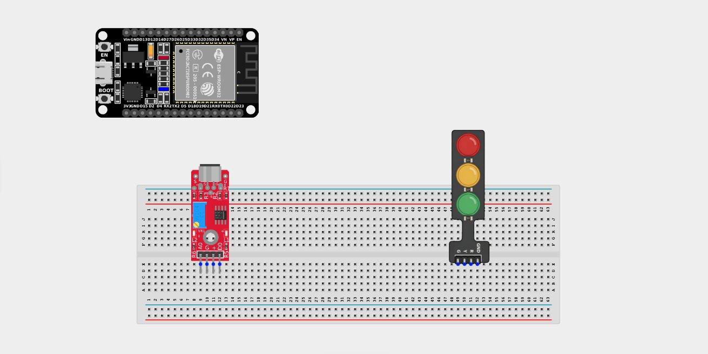
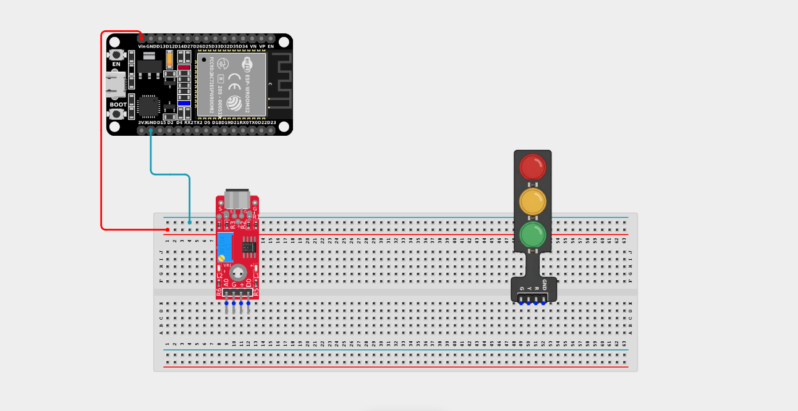
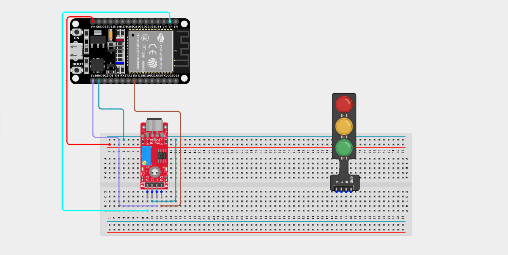
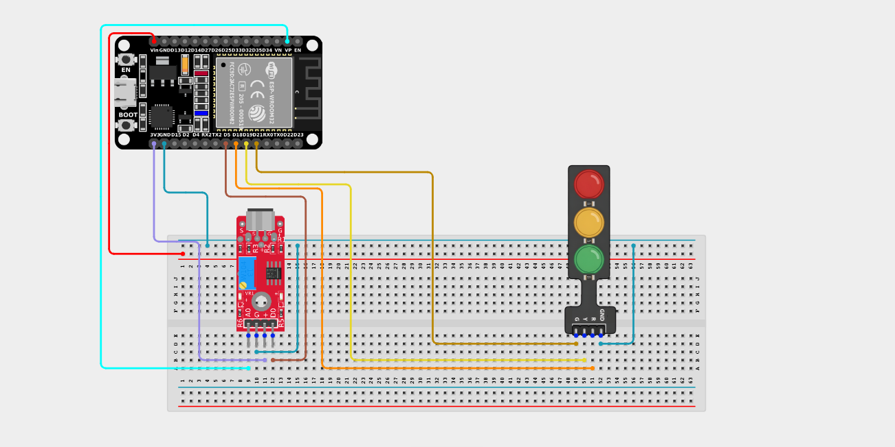

# Project 2.8.1: Controlling a Traffic Light Using a Sound Sensor

| **Description** | Learn how to use a sound sensor with an ESP32 board to detect sound and control a traffic light module. When the sound level exceeds a predefined threshold, the traffic light LEDs light up in sequence. |
|------------------|----------------------------------------------------------------|
| **Use case**     | Sound-activated decorative lighting, music visualizers, sound-responsive displays, and interactive electronics projects. |

## Components (Things You will need)

|  |  |  || ||
|-------------------------|-------------------------|-------------------------|-------------------------|------------------------|--------------------------|

## Building the circuit

> **Tip:** Use the [ESP32 Pin Mapping](../../../../assets/esp32_pin_mapping.png) image to locate the correct GPIO pins on your ESP32 board.

Things Needed:

- ESP32 board = 1  

- Micro USB cable = 1

- Breadboard = 1

- Jumper Wires

- Sound Sensor Module = 1

- Traffic Light Module = 1

---

## Mounting the components on the breadboard

**Step 1:** Mount the ESP32 and Components:

- Align the ESP32 board across the center dividing ridge of the breadboard.

- Insert the Sound Sensor Module so its pins sit in separate adjacent rows.

- Insert the Traffic Light Module into the breadboard so its four pins (G, Y, R, GND) sit in separate adjacent rows.



---

## Wiring the circuit

Follow these step-by-step connection details using your jumper wires:

**Step 1:** Create Power and Ground Rails

- Connect the **5V** or **VIN** pin on the ESP32 board to the positive (red) rail on the breadboard.

- Connect a **GND** pin on the ESP32 board to the negative (blue/black) rail on the breadboard.



**Step 2:** Wire the Sound Sensor Module

- Connect the **+ / VCC** pin of the sound sensor to the 3.3V pin on the ESP32 board (or 3.3V power rail).

- Connect the **G** pin of the sound sensor to the negative ground rail.

- Connect the **AO (Analog Out)** pin of the sound sensor to **GPIO 36 (VP)** on the ESP32 board.

- Connect the **DO (Digital Out)** pin of the sound sensor to **GPIO 5** on the ESP32 board.



**Step 3:** Wire the Traffic Light Module

- Connect the **GND** pin of the traffic light to the negative ground rail.

- Connect the **Red (R)** pin of the traffic light to **GPIO 18** on the ESP32 board.

- Connect the **Yellow (Y)** pin of the traffic light to **GPIO 19** on the ESP32 board.

- Connect the **Green (G)** pin of the traffic light to **GPIO 21** on the ESP32 board.



*Make sure to connect the Micro USB cable securely to the ESP32 board and your computer.*

---

## PROGRAMMING

**Step 1:** Open your Arduino IDE. See how to set up here: [Getting Started](../../Getting Started/Arduino_IDE_Setup.md).

**Step 2:** Write the code in sections as detailed below.

### 1. Variables and Setup

```cpp
const int soundSensorAPin = 36;
const int soundSensorDOPin = 5;

const int redPin = 18;
const int yellowPin = 19;
const int greenPin = 21;

void setup() {
  Serial.begin(9600);
  
  pinMode(soundSensorDOPin, INPUT);
  
  pinMode(redPin, OUTPUT);
  pinMode(yellowPin, OUTPUT);
  pinMode(greenPin, OUTPUT);
  
  Serial.println("Sound-Activated Traffic Light Online!");
}
```
*Explanation:* We map out our analog and digital sound pins, as well as the 3 output pins for our traffic lights. 

---

### 2. Main Loop

```cpp
void loop() {
  // Read exact sound volume (Analog) and loud noise state (Digital)
  int soundValue = analogRead(soundSensorAPin); 
  int digitalValue = digitalRead(soundSensorDOPin); 
  
  Serial.print("Sound Volume: ");
  Serial.println(soundValue);
  
  // Logic: If the volume exceeds 100, trigger the light sequence!
  if (soundValue > 100) {  
    // 1. Red Light On
    digitalWrite(redPin, HIGH); 
    digitalWrite(yellowPin, LOW);
    digitalWrite(greenPin, LOW);
    delay(500); 
    
    // 2. Yellow Light On
    digitalWrite(redPin, LOW); 
    digitalWrite(yellowPin, HIGH);
    digitalWrite(greenPin, LOW);
    delay(500); 
    
    // 3. Green Light On
    digitalWrite(yellowPin, LOW); 
    digitalWrite(greenPin, HIGH);
    digitalWrite(redPin, LOW);
    delay(500); 
  } else {
    // If it's quiet, keep all lights OFF
    digitalWrite(redPin, LOW);
    digitalWrite(yellowPin, LOW);
    digitalWrite(greenPin, LOW);  
  }
  
  delay(100); // Small delay before next read
}
```
*Explanation:* 

- We read the `soundValue` using `analogRead()`. 

- If someone claps or makes a loud noise (pushing the analog value above 100), the `if` block executes.

- The traffic light quickly cycles through Red, then Yellow, then Green, pausing half a second for each colour!

- If the room is quiet, the `else` block triggers, ensuring all the LEDs stay off.

---

## Uploading the code

**Step 3:** Save your code. _See the [Getting Started](../../Getting Started/Arduino_IDE_Setup.md) section_

**Step 4:** Select the ESP32 board and port _See the [Getting Started](../../Getting Started/Arduino_IDE_Setup.md) section:Selecting ESP32 board Type and Uploading your code_.

**Step 5:** Upload your code. _See the [Getting Started](../../Getting Started/Arduino_IDE_Setup.md) section:Selecting ESP32 board Type and Uploading your code_

## Conclusion

This project demonstrates how raw analog sensor data (the volume of a sound wave) can be converted into a fun, responsive physical sequence of lights. Clapping your hands to trigger the sequence is a perfect example of a sound-activated display!
