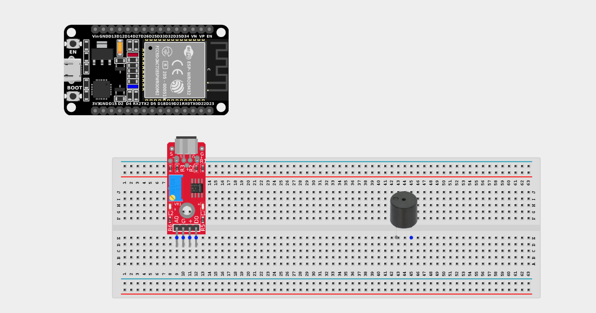
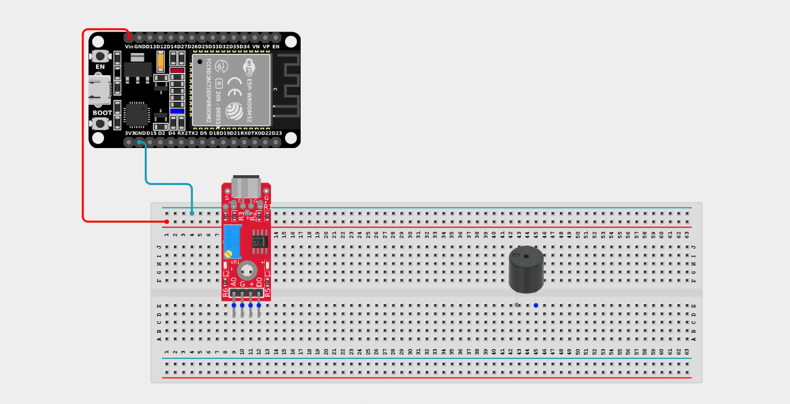
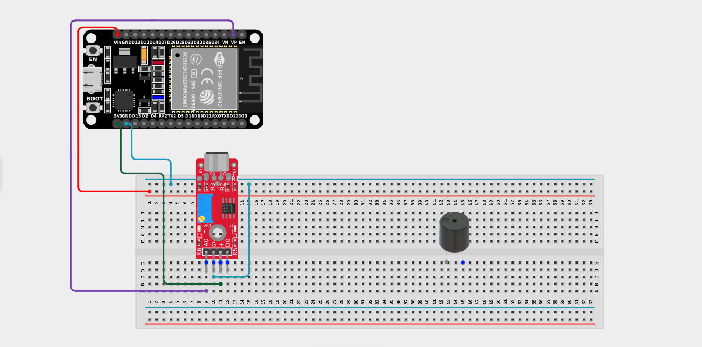
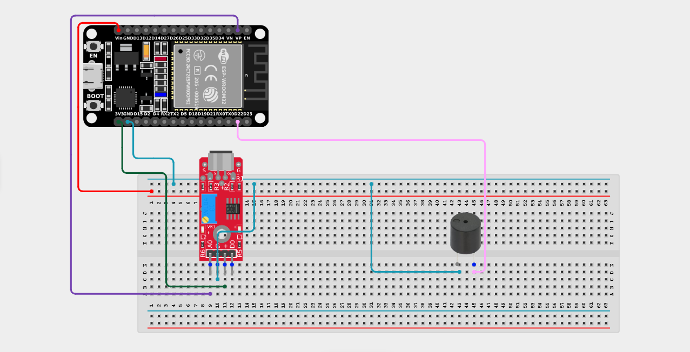

# Project 2.8.2: Sound Controlled Security Siren

| **Description** | This project uses a sound sensor to detect loud noises which triggers a buzzer to emit a siren pattern. The alarm resets after a timeout if silence returns. |
|------------------|----------------------------------------------------------------|
| **Use case**     | Perfect for home security systems, glass-break detectors, or baby monitors where a sudden spike in volume should immediately sound an audible alert to notify people nearby. |

## Components (Things You will need)

| | | | | | |
|-------------------------|-------------------------|-------------------------|-------------------------|-------------------------|-------------------------|

## Building the circuit

> **Tip:** Use the [ESP32 Pin Mapping](../../../../assets/esp32_pin_mapping.png) image to locate the correct GPIO pins on your ESP32 board.

Things Needed:

- ESP32 board = 1

- Micro USB cable = 1

- Breadboard = 1

- Jumper wires

- Sound sensor module = 1

- Active Buzzer = 1

---

## Mounting the components on the breadboard

**Step 1:** Mount the ESP32 and Components:

- Align the ESP32 board across the center dividing ridge of the breadboard.

- Insert the Sound Sensor Module so its pins sit in separate adjacent rows.

- Insert the Buzzer into the breadboard (remember the longer leg is positive).



---

## Wiring the circuit

Follow these step-by-step connection details using your jumper wires:

**Step 1:** Create Power and Ground Rails

- Connect the **5V** or **VIN** pin on the ESP32 board to the positive (red) rail on the breadboard.

- Connect a **GND** pin on the ESP32 board to the negative (blue/black) rail on the breadboard.



**Step 2:** Wire the Sound Sensor

- Connect the **+ / VCC** pin of the Sound Sensor to the 3.3V pin on the ESP32 board (or 3.3V power rail).

- Connect the **G** pin of the Sound Sensor to the negative ground rail.

- Connect the **AO (Analog Output)** pin of the Sound Sensor to **GPIO 36 (VP)** on the ESP32 board.
*(Leave the DO pin unconnected for this project).*




**Step 3:** Wire the Buzzer

- Connect the **positive pin (longer leg)** of the Buzzer to **GPIO 22** on the ESP32 board.

- Connect the **negative pin (shorter leg)** of the Buzzer to the negative ground rail.



*Make sure to connect the Micro USB cable securely to the ESP32 board and your computer.*

---

## PROGRAMMING

**Step 1:** Open your Arduino IDE. See how to set up here: [Getting Started](../../Getting Started/Arduino_IDE_Setup.md).

**Step 2:** Write the code in sections as detailed below.

### 1. Variables and Setup

```cpp
const int soundPin = 36;
const int buzzerPin = 22;

const int soundThreshold = 600; 
const unsigned long alarmTimeout = 3000; // 3 seconds

bool alarmActive = false;
unsigned long lastLoudSound = 0;

void setup() {
  Serial.begin(9600);
  pinMode(buzzerPin, OUTPUT);
  Serial.println("Security System Armed. Listening for noise...");
}
```
*Explanation:* We declare our analog sound pin and the buzzer. `soundThreshold` determines how loud a noise must be to trigger the alarm. `alarmTimeout` is how long the alarm will continue sounding after the room gets quiet again.

---

### 2. Main Loop

```cpp
void loop() {
  // 1. Listen to the room volume
  int soundValue = analogRead(soundPin);
  
  Serial.print("Current Noise Level: ");
  Serial.println(soundValue);
  
  // 2. Check if volume exceeds our threshold
  if (soundValue >= soundThreshold) {
    alarmActive = true;
    lastLoudSound = millis(); // Record exactly when the loud noise happened
  }
  
  // 3. Check if it's been quiet for long enough to turn the alarm off
  if (alarmActive && (millis() - lastLoudSound > alarmTimeout)) {
    alarmActive = false;
    noTone(buzzerPin);
    Serial.println("Silence returned. System resetting.");
  }
  
  // 4. If the alarm is active, play the siren effect!
  if (alarmActive) {
    // Pitch goes UP (700Hz to 1200Hz)
    for (int frequency = 700; frequency <= 1200; frequency += 20) {
      tone(buzzerPin, frequency);
      delay(10); 
    }
    // Pitch goes DOWN (1200Hz to 700Hz)
    for (int frequency = 1200; frequency >= 700; frequency -= 20) {
      tone(buzzerPin, frequency);
      delay(10); 
    } 
  } else { 
    // If not active, ensure buzzer is off
    noTone(buzzerPin);
    delay(20); 
  }
}
```
*Explanation:* 

- We continuously monitor the `soundValue`. 

- If a loud noise happens, `alarmActive` becomes `true`, and we use `millis()` (the ESP32's internal stopwatch) to record the time.

- If `alarmActive` is true, the buzzer sweeps its pitch up and down rapidly, creating a very authentic "WEE-WOO" siren effect using `for` loops!

- If 3 seconds (`alarmTimeout`) pass without any loud noises, the system resets itself and silences the buzzer.

---

## Uploading the code

**Step 3:** Save your code. _See the [Getting Started](../../Getting Started/Arduino_IDE_Setup.md) section_

**Step 4:** Select the ESP32 board and port _See the [Getting Started](../../Getting Started/Arduino_IDE_Setup.md) section:Selecting ESP32 board Type and Uploading your code_.

**Step 5:** Upload your code. _See the [Getting Started](../../Getting Started/Arduino_IDE_Setup.md) section:Selecting ESP32 board Type and Uploading your code_

## Conclusion

This project introduces you to the `millis()` function for non-blocking timers, allowing your alarm to automatically reset itself without freezing the rest of your code using standard delays!
