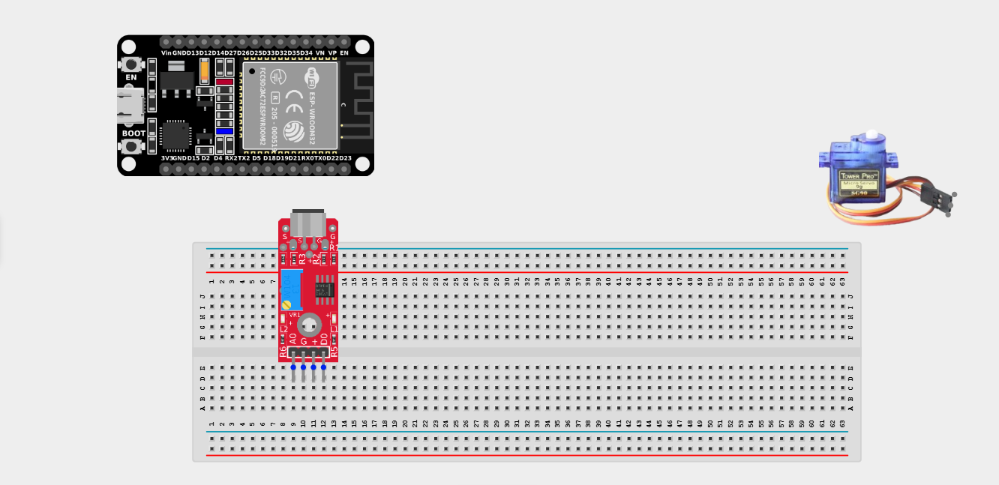
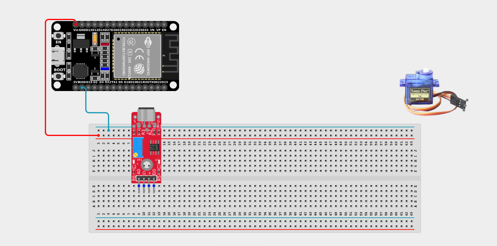
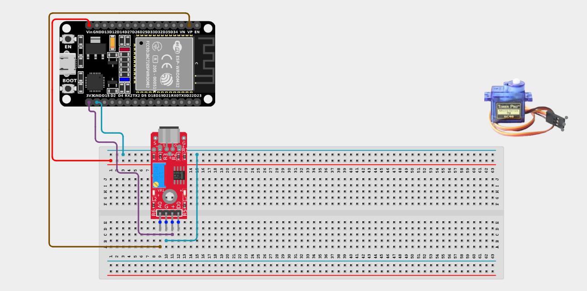
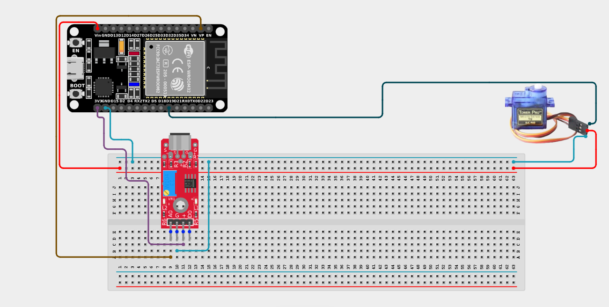

# Project 2.8.3: Acoustic Doggy Door Latch

| **Description** | This project uses a sound sensor to detect a specific sound (like a loud bark) and activates a servo motor to unlock a latch for 5 seconds before auto-locking. |
|------------------|----------------------------------------------------------------|
| **Use case**     | Perfect for pet doors, "Clap on / Clap off" smart home systems, or voice-activated locks where a sharp acoustic signature triggers a physical mechanical action. |

## Components (Things You will need)

|  |  |  |  |  |  |
|-------------------------|-------------------------|-------------------------|-------------------------|-------------------------|-------------------------|

## Building the circuit

> **Tip:** Use the [ESP32 Pin Mapping](../../../../assets/esp32_pin_mapping.png) image to locate the correct GPIO pins on your ESP32 board.

Things Needed:

- ESP32 board = 1

- Micro USB cable = 1

- Breadboard = 1

- Jumper wires 

- Sound sensor module = 1

- Servo motor = 1

---

## Mounting the components on the breadboard

**Step 1:** Mount the ESP32 and Components:

- Align the ESP32 board across the center dividing ridge of the breadboard.

- Insert the Sound Sensor into the breadboard so its pins sit in separate adjacent rows.

- The Servo Motor will sit loose, connected via male-to-male jumper wires.


---

## Wiring the circuit

Follow these step-by-step connection details using your jumper wires:

**Step 1:** Create Power and Ground Rails

- Connect the **5V** or **VIN** pin on the ESP32 board to the positive (red) rail on the breadboard.

- Connect a **GND** pin on the ESP32 board to the negative (blue/black) rail on the breadboard.


**Step 2:** Wire the Sound Sensor

- Connect the **+ / VCC** pin of the Sound Sensor to the 3.3V pin on the ESP32 board (or 3.3V power rail).

- Connect the **G** pin of the Sound Sensor to the negative ground rail.

- Connect the **AO (Analog Output)** pin to **GPIO 36 (VP)** on the ESP32 board.
*(Leave the DO pin unconnected)*.



**Step 3:** Wire the Servo Motor

- Connect the **GND (Brown/Black)** wire of the servo to the negative ground rail.

- Connect the **VCC (Red)** wire of the servo to the positive 5V power rail.

- Connect the **Signal (Orange/Yellow)** wire of the servo to **GPIO 19** on the ESP32 board.



*Make sure to connect the Micro USB cable securely to the ESP32 board and attach the servo blade securely.*

---

## PROGRAMMING

**Step 1:** Open your Arduino IDE. See how to set up here: [Getting Started](../../Getting Started/Arduino_IDE_Setup.md).

**Step 2:** Write the code in sections as detailed below.

### 1. Variables and Setup

```cpp
#include <ESP32Servo.h>

const int soundPin = 36;
const int servoPin = 19;

const int soundThreshold = 600; 
const int lockedPosition = 0;   
const int unlockedPosition = 90;
const unsigned long unlockTime = 5000; // 5 seconds

Servo lockServo;
bool unlocked = false;
unsigned long unlockStartTime = 0;

void setup() {
  Serial.begin(9600);
  
  lockServo.attach(servoPin);
  lockServo.write(lockedPosition); // Start locked!
  
  Serial.println("Acoustic Latch Armed. Waiting for command...");
}
```
*Explanation:* We include the `ESP32Servo.h` library to control the motor. We set a `soundThreshold` (how loud the bark/clap needs to be) and define exactly where the servo should position itself when "locked" (0 degrees) and "unlocked" (90 degrees).

---

### 2. Main Loop

```cpp
void loop() {
  int soundValue = analogRead(soundPin);
  
  Serial.print("Current Noise Level: ");
  Serial.println(soundValue);
  
  // 1. Check for loud noise IF the door is currently locked
  if (!unlocked && soundValue >= soundThreshold) {
    Serial.println(">>> LOUD NOISE DETECTED! UNLOCKING DOOR!");
    lockServo.write(unlockedPosition); // Physically move the latch
    unlocked = true;
    unlockStartTime = millis(); // Start the 5-second timer
  }
  
  // 2. Check if the 5 seconds has passed since it was unlocked
  if (unlocked && (millis() - unlockStartTime >= unlockTime)) {
    Serial.println(">>> Time expired. Locking door.");
    lockServo.write(lockedPosition); // Physically move the latch back
    unlocked = false;
  }
  
  delay(50); // Small delay before reading sound again
}
```
*Explanation:* 

- The ESP32 constantly listens to the microphone volume.

- If the volume spikes past `600` AND the door isn't already unlocked, it triggers the servo to move to `90` degrees. It immediately saves the exact time it did this using `millis()`.

- The second `if` block constantly checks the clock. As soon as 5000 milliseconds (5 seconds) have passed since `unlockStartTime`, it commands the servo to move back to `0` degrees, re-securing the door automatically!

---

## Uploading the code

**Step 3:** Save your code. _See the [Getting Started](../../Getting Started/Arduino_IDE_Setup.md) section_

**Step 4:** Select the ESP32 board and port _See the [Getting Started](../../Getting Started/Arduino_IDE_Setup.md) section:Selecting ESP32 board Type and Uploading your code_.

**Step 5:** Upload your code. _See the [Getting Started](../../Getting Started/Arduino_IDE_Setup.md) section:Selecting ESP32 board Type and Uploading your code_

## Conclusion

This project teaches you how to bridge the gap between acoustic sensing and physical mechanical actuation, creating smart, hands-free hardware interfaces!
