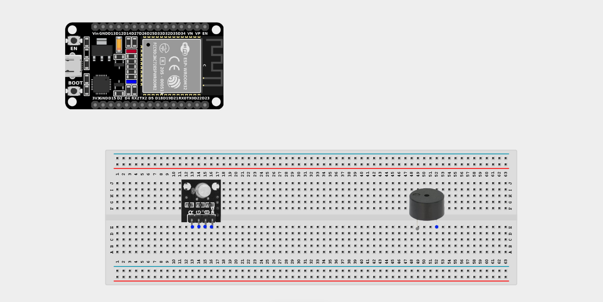
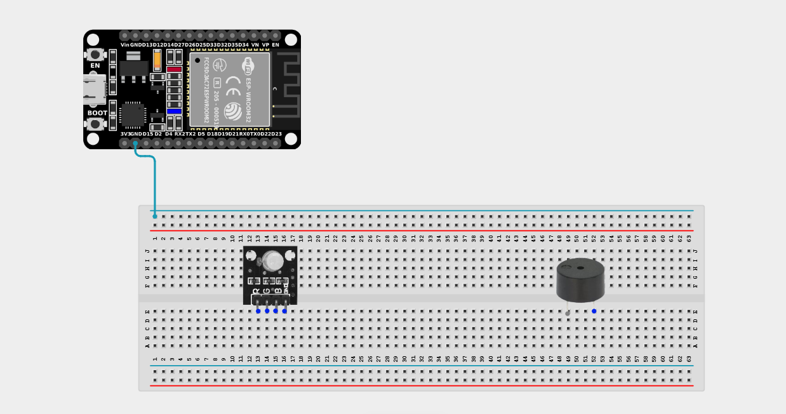
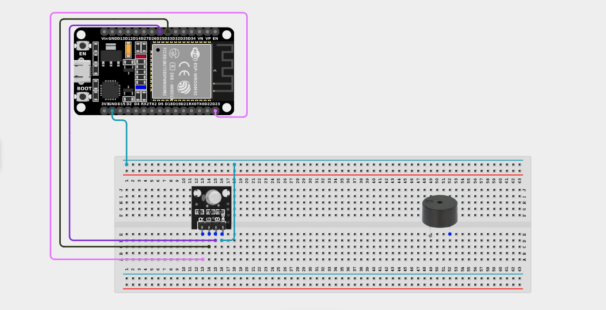
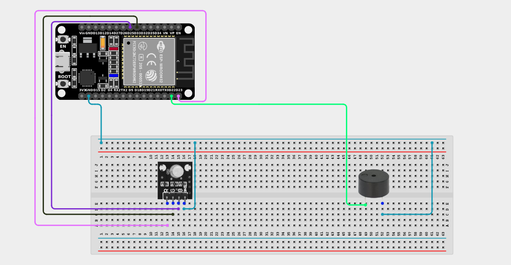

# Project 2.8.4: Visual Siren Alert

| **Description** | This project creates a police-style siren effect where the buzzer tones rise and fall in sync with red-blue alternating flashes on the RGB LED. |
|------------------|----------------------------------------------------------------|
| **Use case**     | Used in emergency vehicles, high-alert security systems, and industrial hazard warnings where both intense visual and auditory signals are required to capture immediate attention. |

## Components (Things You will need)

| | | | | | |
|-------------------------|-------------------------|-------------------------|-------------------------|-------------------------|-------------------------|

## Building the circuit

> **Tip:** Use the [ESP32 Pin Mapping](../../../../assets/esp32_pin_mapping.png) image to locate the correct GPIO pins on your ESP32 board.

Things Needed:

- ESP32 board = 1

- Micro USB cable = 1

- Breadboard = 1

- Jumper wires

- RGB LED module = 1

- Active Buzzer = 1

---

## Mounting the components on the breadboard

**Step 1:** Mount the ESP32 and Components:

- Align the ESP32 board across the center dividing ridge of the breadboard.

- Insert the RGB LED Module into the breadboard so its four pins sit in separate adjacent rows.

- Insert the Buzzer into the breadboard (remember the longer leg is positive).


---

---

## Wiring the circuit

Follow these step-by-step connection details using your jumper wires:

**Step 1:** Create Ground Rail

- Connect a **GND** pin on the ESP32 board to the negative (blue/black) rail on the breadboard.


**Step 2:** Wire the RGB LED

- Connect the **GND** pin (usually the longest leg, or marked '-') of the RGB LED to the negative ground rail.

- Connect the **Red (R)** pin of the RGB LED to **GPIO 23** on the ESP32 board.

- Connect the **Green (G)** pin of the RGB LED to **GPIO 33** on the ESP32 board.

- Connect the **Blue (B)** pin of the RGB LED to **GPIO 25** on the ESP32 board.


**Step 3:** Wire the Buzzer

- Connect the **positive pin (longer leg)** of the Buzzer to **GPIO 22** on the ESP32 board.

- Connect the **negative pin (shorter leg)** of the Buzzer to the negative ground rail.



*Make sure to connect the Micro USB cable securely to the ESP32 board and your computer.*

---

## PROGRAMMING

**Step 1:** Open your Arduino IDE. See how to set up here: [Getting Started](../../Getting Started/Arduino_IDE_Setup.md).

**Step 2:** Write the code in sections as detailed below.

### 1. Variables and Setup

```cpp
const int redPin = 23;
const int greenPin = 33;
const int bluePin = 25;

const int buzzerPin = 22;

void setup() {
  Serial.begin(9600);
  
  pinMode(redPin, OUTPUT);
  pinMode(greenPin, OUTPUT);
  pinMode(bluePin, OUTPUT);
  
  pinMode(buzzerPin, OUTPUT);
  
  Serial.println("Visual Siren Initialized!");
}
```
*Explanation:* We set all our RGB color pins and the buzzer pin as `OUTPUT`s so the ESP32 can send voltage to them.

---

### 2. Main Loop and Helper Function

```cpp
void loop() {
  // Phase 1: Pitch goes UP, Light is RED
  setColor(255, 0, 0); // Pure Red
  for (int freq = 600; freq <= 1200; freq += 20) {
    tone(buzzerPin, freq);
    delay(20); 
  }
  
  // Phase 2: Pitch goes DOWN, Light is BLUE
  setColor(0, 0, 255); // Pure Blue
  for (int freq = 1200; freq >= 600; freq -= 20) {
    tone(buzzerPin, freq);
    delay(20); 
  } 
}

// Custom Helper Function to easily set RGB colors!
void setColor(int red, int green, int blue) {
  analogWrite(redPin, red);
  analogWrite(greenPin, green);
  analogWrite(bluePin, blue);
}
```
*Explanation:* 

- We use a custom function `setColor()` to quickly change the RGB light color using `analogWrite()`.

- The main loop has two phases:
  - **Phase 1:** Sets the light to intense Red. It then uses a `for` loop to sweep the buzzer pitch upwards from 600Hz to 1200Hz.
  - **Phase 2:** Switches the light instantly to intense Blue. It then uses another `for` loop to sweep the buzzer pitch downwards back to 600Hz.

- Because `loop()` runs forever, this creates a continuous, highly visible, and highly audible police-siren effect!

---

## Uploading the code

**Step 3:** Save your code. _See the [Getting Started](../../Getting Started/Arduino_IDE_Setup.md) section_

**Step 4:** Select the ESP32 board and port _See the [Getting Started](../../Getting Started/Arduino_IDE_Setup.md) section:Selecting ESP32 board Type and Uploading your code_.

**Step 5:** Upload your code. _See the [Getting Started](../../Getting Started/Arduino_IDE_Setup.md) section:Selecting ESP32 board Type and Uploading your code_

## Conclusion

This project shows how combining tightly synchronized visual effects (color shifting) with audio effects (pitch sweeping) creates powerful psychological responses, vital for emergency alert system design!
