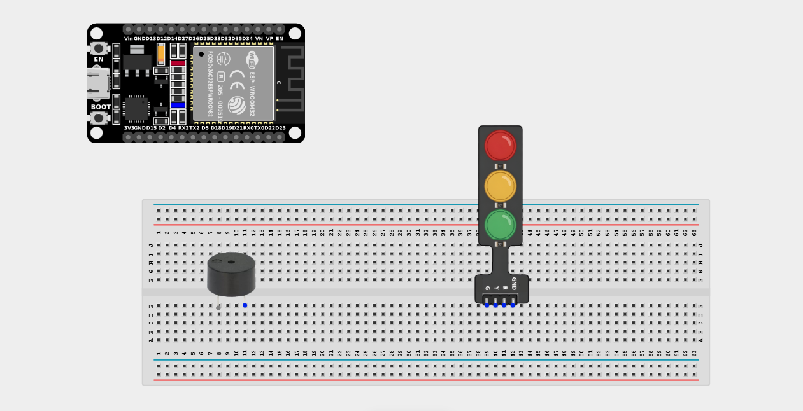
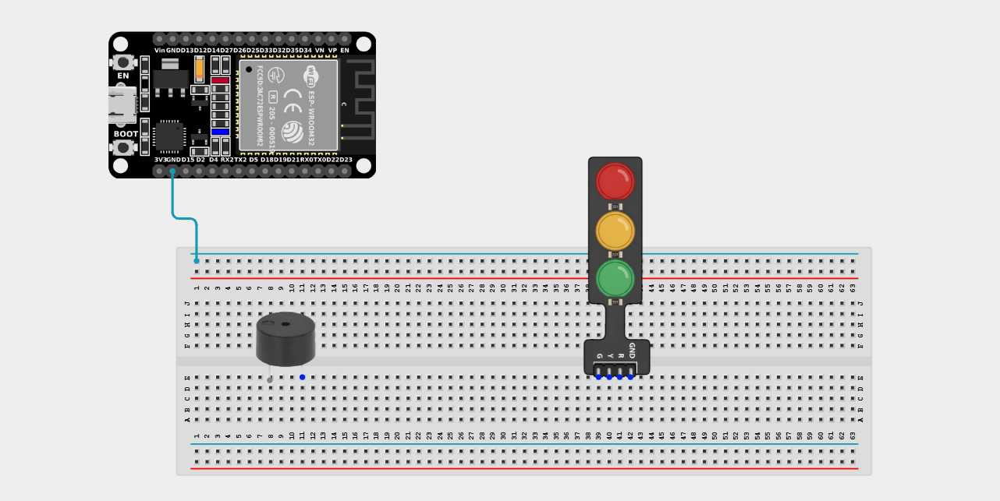
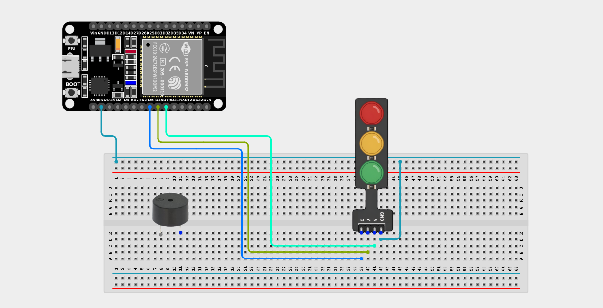
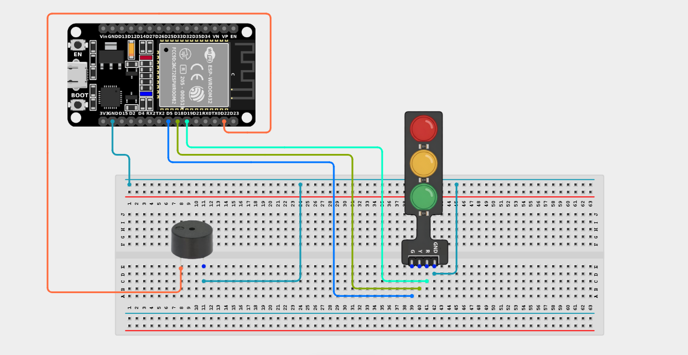

# Project 2.8.5: Audible Crosswalk Signal

| **Description** | This project makes the Traffic Light change colors while the buzzer chirps at different rates - slow beeps for Red, fast beeps for Green. |
| --- | --- |
| **Use case** | Used in modern pedestrian crosswalk systems to aid visually impaired individuals. Slow beeps indicate "Do not cross," while rapid beeps clearly communicate "Safe to cross." |

## Components (Things You will need)

|  |  |  |  |  |  |
| --- | --- | --- | --- | --- | --- |

## Building the circuit

> **Tip:** Use the [ESP32 Pin Mapping](../../../../assets/esp32_pin_mapping.png) image to locate the correct GPIO pins on your ESP32 board.

Things Needed:

- ESP32 board = 1

- Micro USB cable = 1

- Breadboard = 1

- Jumper wires

- Traffic light module = 1

- Active Buzzer = 1

---

## Mounting the components on the breadboard

**Step 1:** Mount the ESP32 and Components:

- Align the ESP32 board across the center dividing ridge of the breadboard.

- Insert the Traffic Light Module into the breadboard so its four pins (G, Y, R, GND) sit in separate adjacent rows.

- Insert the Buzzer into the breadboard (remember the longer leg is positive).



---

## Wiring the circuit

Follow these step-by-step connection details using your jumper wires:

**Step 1:** Create Ground Rail

- Connect a **GND** pin on the ESP32 board to the negative (blue/black) rail on the breadboard.


**Step 2:** Wire the Traffic Light Module

- Connect the **GND** pin of the traffic light to the negative ground rail.

- Connect the **Green (G)** pin of the traffic light to **GPIO 5** on the ESP32 board.

- Connect the **Yellow (Y)** pin of the traffic light to **GPIO 18** on the ESP32 board.

- Connect the **Red (R)** pin of the traffic light to **GPIO 19** on the ESP32 board.



**Step 3:** Wire the Buzzer

- Connect the **positive pin (longer leg)** of the Buzzer to **GPIO 22** on the ESP32 board.

- Connect the **negative pin (shorter leg)** of the Buzzer to the negative ground rail.




*Make sure to connect the Micro USB cable securely to the ESP32 board and your computer.*

---

## PROGRAMMING

**Step 1:** Open your Arduino IDE. See how to set up here: [Getting Started](../../Getting Started/Arduino_IDE_Setup.md).

**Step 2:** Write the code in sections as detailed below.

### 1. Variables and Setup

```cpp
const int greenLED = 5;
const int yellowLED = 18;
const int redLED = 19;

const int buzzerPin = 22;

void setup() {
  Serial.begin(9600);
  
  pinMode(greenLED, OUTPUT);
  pinMode(yellowLED, OUTPUT);
  pinMode(redLED, OUTPUT);
  
  pinMode(buzzerPin, OUTPUT);
  Serial.println("Crosswalk System Initialized.");
}
```
*Explanation:* We assign our pins based on our wiring. All LEDs and the buzzer are set as `OUTPUT` devices.

---

### 2. Main Loop and Helper Function

```cpp
void loop() {
  // Phase 1: DO NOT WALK (Red Light) -> Slow Beeps
  digitalWrite(redLED, HIGH);
  digitalWrite(yellowLED, LOW);
  digitalWrite(greenLED, LOW);
  Serial.println("DON'T WALK");
  beepPattern(3, 500); // 3 beeps, 500ms intervals
  
  // Phase 2: GET READY (Yellow Light) -> Medium Beeps
  digitalWrite(redLED, LOW);
  digitalWrite(yellowLED, HIGH);
  digitalWrite(greenLED, LOW);
  Serial.println("GET READY");
  beepPattern(4, 250); // 4 beeps, 250ms intervals
  
  // Phase 3: WALK (Green Light) -> Fast Beeps
  digitalWrite(redLED, LOW);
  digitalWrite(yellowLED, LOW);
  digitalWrite(greenLED, HIGH);
  Serial.println("WALK!");
  beepPattern(8, 125); // 8 beeps, very fast 125ms intervals
}

// Custom Helper Function to generate beep patterns easily!
void beepPattern(int count, int interval) {
  for (int i = 0; i < count; i++) {
    tone(buzzerPin, 1000);   // Turn buzzer ON at 1000Hz
    delay(interval / 2);     // Wait
    noTone(buzzerPin);       // Turn buzzer OFF
    delay(interval / 2);     // Wait
  } 
}
```
*Explanation:* 

- We created a custom helper function called `beepPattern(count, interval)`. This allows us to generate a specific number of beeps at a specific speed without rewriting huge blocks of delay code!

- When the light is Red, it beeps 3 times very slowly. 

- When the light turns Yellow, the beeps speed up. 

- When the light turns Green, it fires off 8 rapid-fire beeps, signaling clearly that it is time to move quickly across the street!

---

## Uploading the code

**Step 3:** Save your code. _See the [Getting Started](../../Getting Started/Arduino_IDE_Setup.md) section_

**Step 4:** Select the ESP32 board and port _See the [Getting Started](../../Getting Started/Arduino_IDE_Setup.md) section:Selecting ESP32 board Type and Uploading your code_.

**Step 5:** Upload your code. _See the [Getting Started](../../Getting Started/Arduino_IDE_Setup.md) section:Selecting ESP32 board Type and Uploading your code_

## Conclusion

This project demonstrates how inclusive design practices (adding audio cues to visual information) make automated systems safer and more accessible for everyone in a public space!
