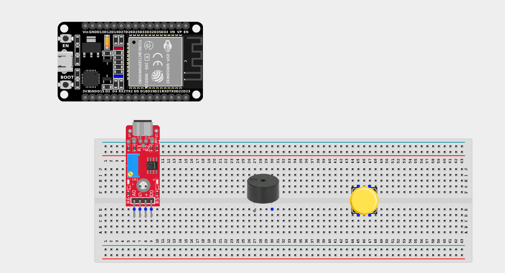
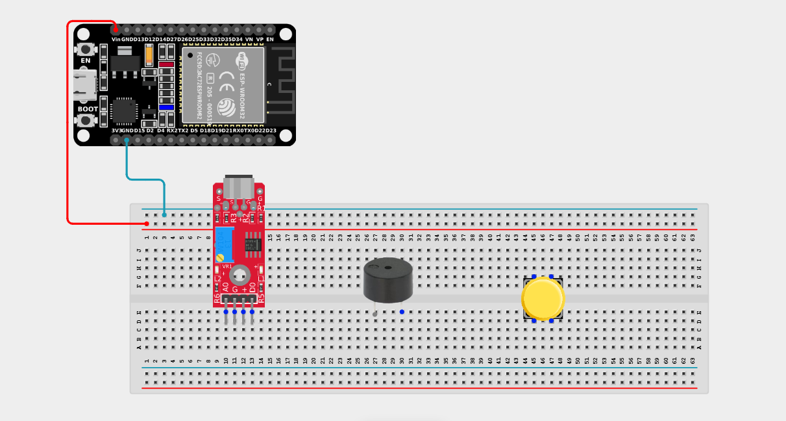
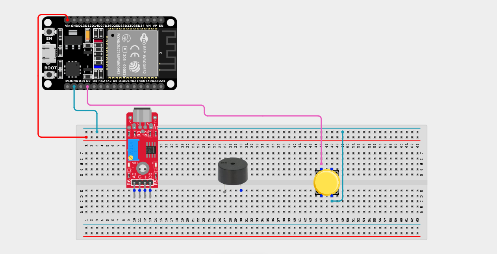
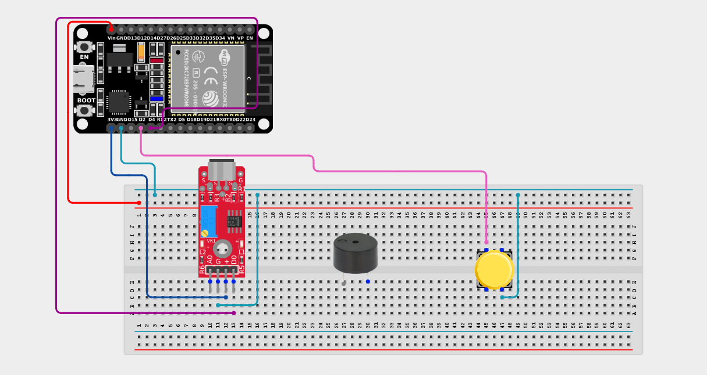
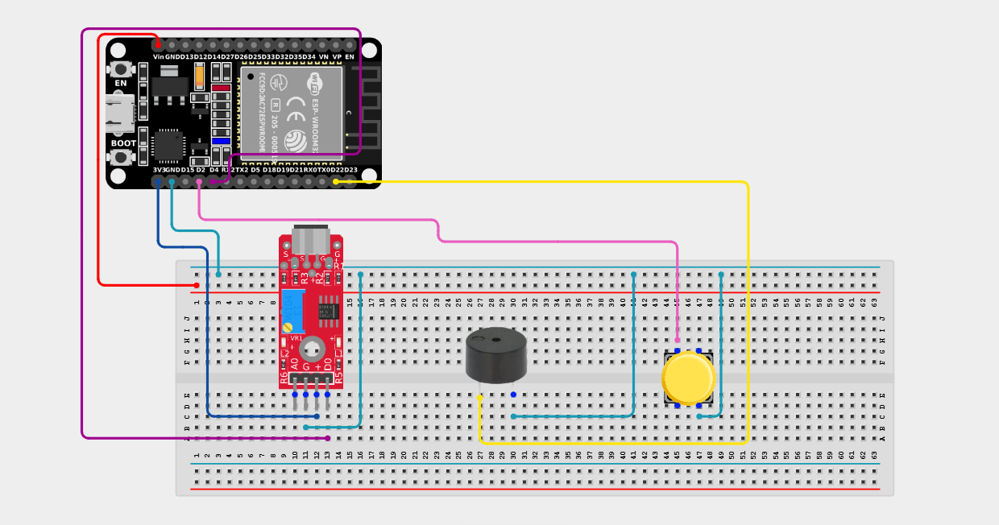

# Project 2.8.6: Arming Security Triggers

| **Description** | This project uses a push button to arm/disarm a security system - the sound sensor triggers an action only when the system is armed. |
|------------------|----------------------------------------------------------------|
| **Use case**     | Used in home and office security systems, allowing you to temporarily disable the alarm (disarm) when you are home, and enable it (arm) before you leave. |

## Components (Things You will need)

|  |  |  |  |  |  |  |
| --- | --- | --- | --- | --- | --- | --- |

## Building the circuit

> **Tip:** Use the [ESP32 Pin Mapping](../../../../assets/esp32_pin_mapping.png) image to locate the correct GPIO pins on your ESP32 board.

Things Needed:

- ESP32 board = 1

- Micro USB cable = 1

- Breadboard = 1

- Jumper wires

- Push button = 1

- Sound sensor module = 1

- Active Buzzer = 1

---

## Mounting the components on the breadboard

**Step 1:** Mount the ESP32 and Components:

- Align the ESP32 board across the center dividing ridge of the breadboard.

- Insert the Push button across the center divider of the breadboard.

- Insert the Sound Sensor Module so its pins sit in separate adjacent rows.

- Insert the Buzzer into the breadboard (remember the longer leg is positive).


---

## Wiring the circuit

Follow these step-by-step connection details using your jumper wires:

**Step 1:** Create Power and Ground Rails

- Connect the **5V** or **VIN** pin on the ESP32 board to the positive (red) rail on the breadboard.

- Connect a **GND** pin on the ESP32 board to the negative (blue/black) rail on the breadboard.



**Step 2:** Wire the Push Button

- Connect **one terminal** of the push button to **GPIO 2** on the ESP32 board.

- Connect the **other terminal** of the push button to the negative ground rail.



**Step 3:** Wire the Sound Sensor

- Connect the **+ / VCC** pin of the Sound sensor to the 3.3V pin on the ESP32 board (or 3.3V power rail).

- Connect the **G** pin of the Sound sensor to the negative ground rail.

- Connect the **DO (Digital Out)** pin of the Sound sensor to **GPIO 4** on the ESP32 board.



**Step 4:** Wire the Buzzer

- Connect the **positive pin (longer leg)** of the buzzer to **GPIO 22** on the ESP32 board.

- Connect the **negative pin (shorter leg)** of the buzzer to the negative ground rail.



*Make sure to connect the Micro USB cable securely to the ESP32 board and your computer.*

---

## PROGRAMMING

**Step 1:** Open your Arduino IDE. See how to set up here: [Getting Started](../../Getting Started/Arduino_IDE_Setup.md).

**Step 2:** Write the code in sections as detailed below.

### 1. Variables and Setup

```cpp
const int buttonPin = 2;
const int soundPin = 4;
const int buzzerPin = 22;

bool systemArmed = false;
bool currentButtonState;
bool lastButtonState = HIGH;

void setup() {
  Serial.begin(9600);
  
  pinMode(buttonPin, INPUT_PULLUP);
  pinMode(soundPin, INPUT);
  
  pinMode(buzzerPin, OUTPUT);
  digitalWrite(buzzerPin, LOW);
  
  Serial.println("Security System Ready.");
  Serial.println("Press the button to Arm/Disarm the system.");
}
```
*Explanation:* We declare our pins and create a boolean variable `systemArmed` which will keep track of whether the alarm is currently active or not.

---

### 2. Main Loop

```cpp
void loop() {
  // 1. Read the button
  currentButtonState = digitalRead(buttonPin);
  
  // 2. Check for a new button press (LOW means pressed because of INPUT_PULLUP)
  if (lastButtonState == HIGH && currentButtonState == LOW) {
    
    // Toggle the armed state
    systemArmed = !systemArmed;
    
    if (systemArmed) {
      Serial.println(">>> System ARMED. Monitoring started...");
      // Play a short chirp to confirm armed status
      tone(buzzerPin, 2000);
      delay(100);
      noTone(buzzerPin);
    } else {
      Serial.println(">>> System DISARMED. Monitoring paused.");
      // Play two low chirps to confirm disarmed status
      tone(buzzerPin, 500); delay(100); noTone(buzzerPin); delay(100);
      tone(buzzerPin, 500); delay(100); noTone(buzzerPin);
    }
    
    delay(200); // Debounce delay
  }
  
  lastButtonState = currentButtonState;
  
  // 3. Check the sound sensor, BUT ONLY IF ARMED!
  if (systemArmed) {
    if (digitalRead(soundPin) == LOW) {
      Serial.println("ALARM! Sound Detected!");
      tone(buzzerPin, 1000);
      delay(500);
      noTone(buzzerPin);
      delay(200); 
    } 
  }
  
  delay(50);
}
```
*Explanation:* 

- Every time you press the button, it toggles the `systemArmed` variable between true (armed) and false (disarmed), playing different audio chirps so you know which state it is in.

- In the second half of the loop, the `digitalRead(soundPin)` is safely tucked *inside* an `if (systemArmed)` block. 

- If the system is disarmed, the ESP32 completely ignores any loud noises. If it is armed, loud noises will immediately trigger the buzzer alarm!

---

## Uploading the code

**Step 3:** Save your code. _See the [Getting Started](../../Getting Started/Arduino_IDE_Setup.md) section_

**Step 4:** Select the ESP32 board and port _See the [Getting Started](../../Getting Started/Arduino_IDE_Setup.md) section:Selecting ESP32 board Type and Uploading your code_.

**Step 5:** Upload your code. _See the [Getting Started](../../Getting Started/Arduino_IDE_Setup.md) section:Selecting ESP32 board Type and Uploading your code_

## Conclusion

This project shows you how to use a physical switch to "gate" or control the flow of logic in your software, allowing users to override automated systems safely!
