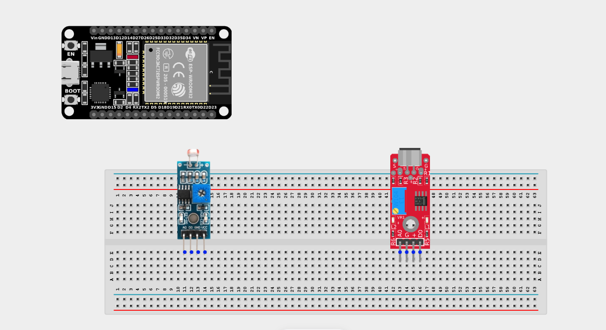
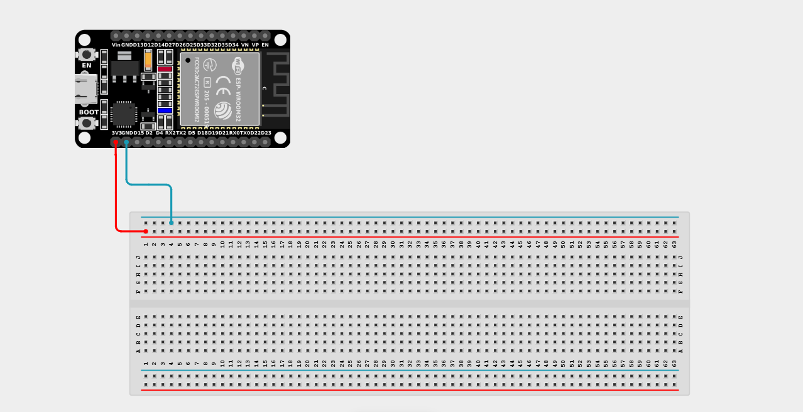
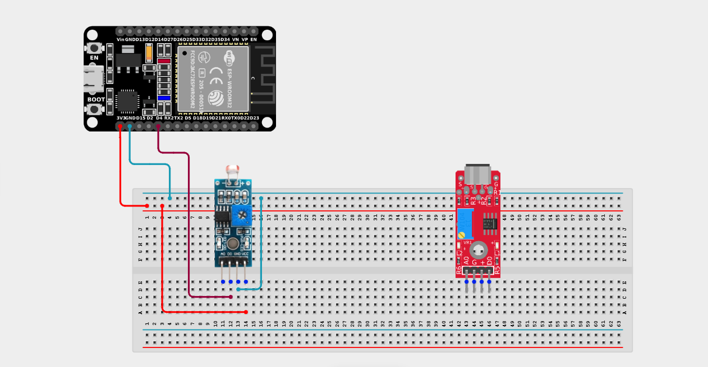
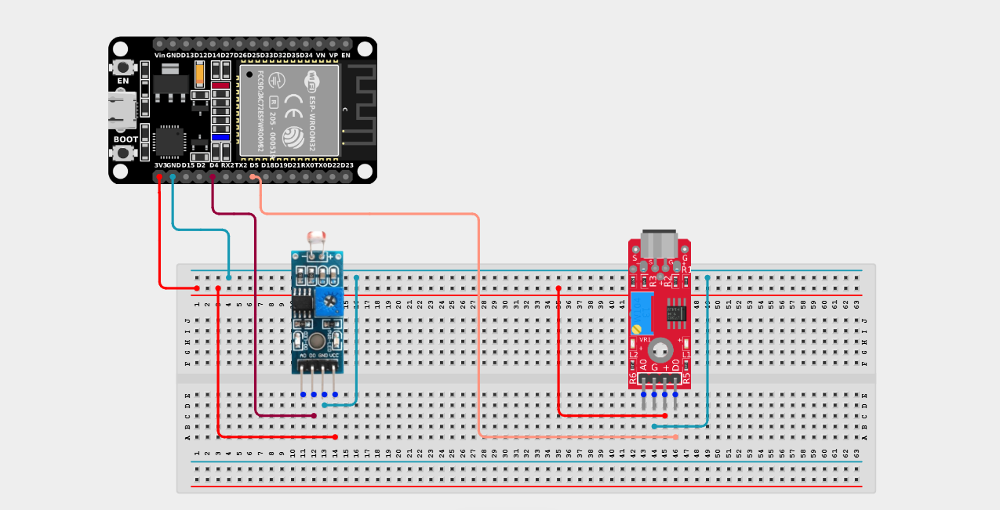

# Project 2.8.7: Darkness Audio Logger

| **Description** | This project logs sound levels only when the LDR detects darkness, allowing nighttime-only audio monitoring. |
|------------------|----------------------------------------------------------------|
| **Use case**     | Used in nighttime wildlife observation, nocturnal security surveillance, and smart outdoor systems that should only record or react to sound events after the sun goes down. |

## Components (Things You will need)

|  |  |  |  |  |  |
| --- | --- | --- | --- | --- | --- |

## Building the circuit

> **Tip:** Use the [ESP32 Pin Mapping](../../../../assets/esp32_pin_mapping.png) image to locate the correct GPIO pins on your ESP32 board.

Things Needed:

- ESP32 board = 1

- Micro USB cable = 1

- Breadboard = 1

- Jumper wires

- LDR module = 1

- Sound sensor module = 1

---

## Mounting the components on the breadboard

**Step 1:** Mount the ESP32 and Components:

- Align the ESP32 board across the center dividing ridge of the breadboard.

- Insert the LDR Module so its pins sit in separate adjacent rows.

- Insert the Sound Sensor Module so its pins sit in separate adjacent rows.



---

## Wiring the circuit

Follow these step-by-step connection details using your jumper wires:

**Step 1:** Create Power and Ground Rails

- Connect the **3.3V** or **VIN** pin on the ESP32 board to the positive (red) rail on the breadboard.

- Connect a **GND** pin on the ESP32 board to the negative (blue/black) rail on the breadboard.



**Step 2:** Wire the LDR Module

- Connect the **VCC** pin of the LDR to the 3.3V pin on the ESP32 board (or 3.3V power rail).

- Connect the **GND** pin of the LDR to the negative ground rail.

- Connect the **DO (Digital Out)** pin of the LDR to **GPIO 4** on the ESP32 board.



**Step 3:** Wire the Sound Sensor

- Connect the **+ / VCC** pin of the Sound Sensor to the 3.3V pin on the ESP32 board (or 3.3V power rail).

- Connect the **G** pin of the Sound Sensor to the negative ground rail.

- Connect the **DO (Digital Out)** pin of the Sound Sensor to **GPIO 5** on the ESP32 board.



*Make sure to connect the Micro USB cable securely to the ESP32 board and your computer.*

---

## PROGRAMMING

**Step 1:** Open your Arduino IDE. See how to set up here: [Getting Started](../../Getting Started/Arduino_IDE_Setup.md).

**Step 2:** Write the code in sections as detailed below.

### 1. Variables and Setup

```cpp
const int ldrPin = 4;
const int soundPin = 5;

void setup() {
  Serial.begin(9600);
  
  pinMode(ldrPin, INPUT);
  pinMode(soundPin, INPUT);
  
  Serial.println("Nighttime Audio Logger Activated.");
}
```
*Explanation:* We define our two digital input pins.

---

### 2. Main Loop

```cpp
void loop() {
  // Read the state of the light sensor
  // (Usually HIGH = dark, LOW = light, but depends on your module's tuning)
  int isDark = digitalRead(ldrPin);
  
  if (isDark == HIGH) {
    Serial.println("[NIGHT] Nighttime Detected. Monitoring Audio...");
    
    // Check if the sound sensor hears a loud noise (LOW = noise detected)
    if (digitalRead(soundPin) == LOW) {
      Serial.println("  ---> [EVENT] LOUD SOUND LOGGED!");
    } else {
      Serial.println("  ---> Quiet.");
    }
    
  } else {
    // If it's daytime, skip the audio check!
    Serial.println("[DAY] Daytime Detected. Sound Monitoring Sleeping.");
  }
  
  delay(500); // Check environmental status twice a second
}
```
*Explanation:* 

- We use a nested `if` statement! 

- The outer `if` statement checks the `ldrPin` to see if it is dark out.

- If it *is* dark, it executes the inner block, which checks the `soundPin` to see if a noise was detected.

- If it is bright out, the outer `if` fails, and the code jumps straight to the `else` block, completely bypassing the audio sensor check.

---

## Uploading the code

**Step 3:** Save your code. _See the [Getting Started](../../Getting Started/Arduino_IDE_Setup.md) section_

**Step 4:** Select the ESP32 board and port _See the [Getting Started](../../Getting Started/Arduino_IDE_Setup.md) section:Selecting ESP32 board Type and Uploading your code_.

**Step 5:** Upload your code. _See the [Getting Started](../../Getting Started/Arduino_IDE_Setup.md) section:Selecting ESP32 board Type and Uploading your code_

## Conclusion

This project teaches you how to use nested conditional statements to make one sensor act as a "master switch" for another sensor, creating contextual awareness for your device!
