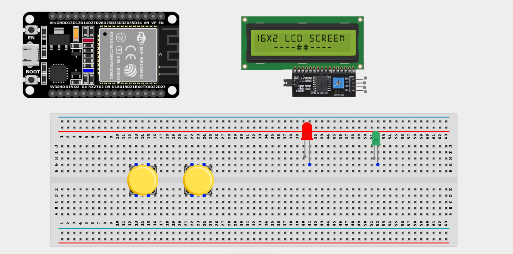
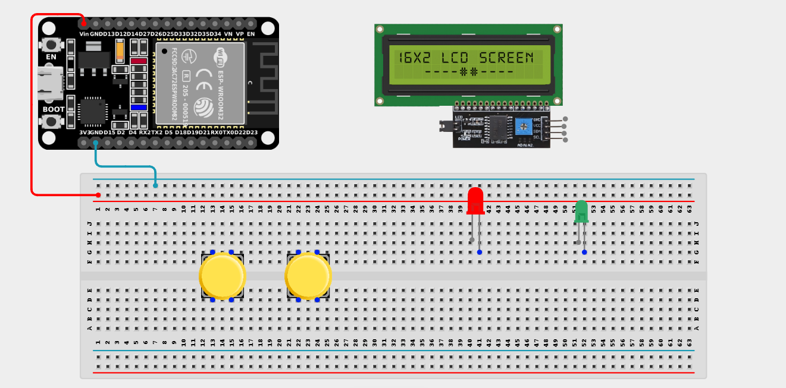
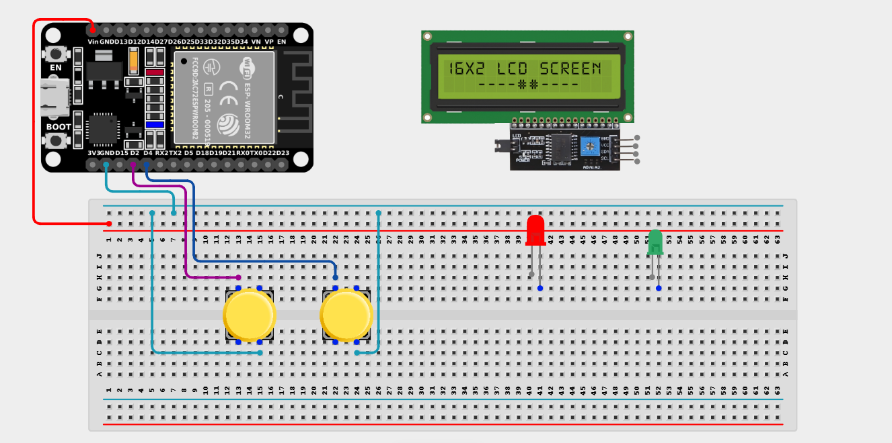
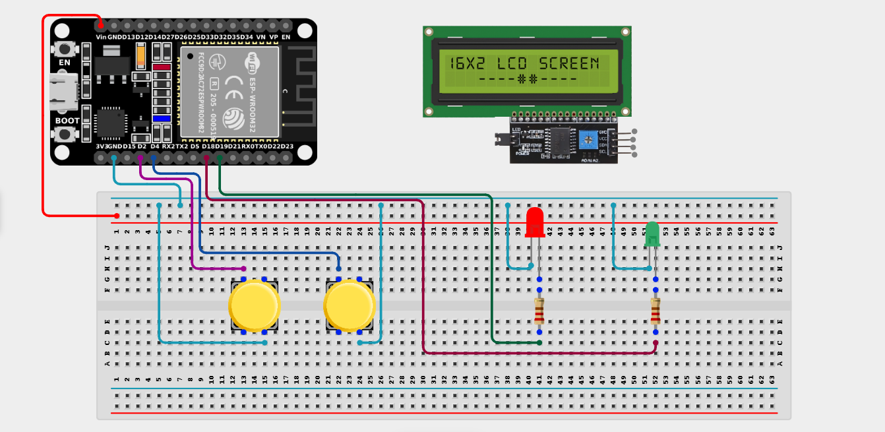
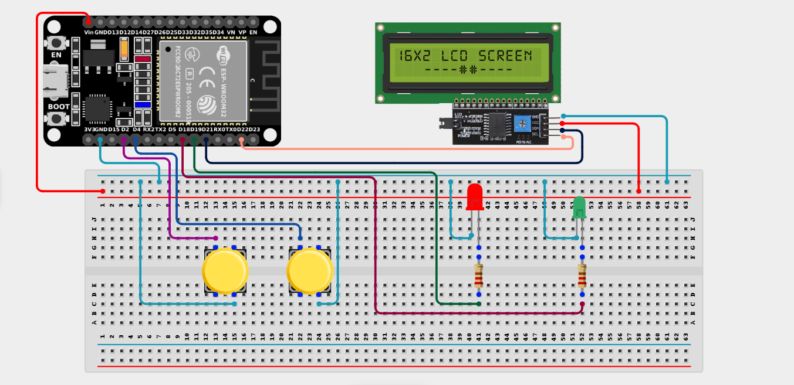

# Project 2.9: Interactive Quiz Console

| **Description** | This project introduces user interaction, decision-making logic, score tracking, and feedback systems. Two buttons act as True/False inputs. LEDs and an LCD display provide immediate visual feedback. |
|------------------|----------------------------------------------------------------|
| **Use case**     | This project demonstrates how computers collect user input, evaluate responses, and provide feedback. Similar systems are used in online tests, learning games, and classroom assessment platforms. |

## Components (Things You will need)

|  |  |  |  |  |  |  |  |
| --- | --- | --- | --- | --- | --- | --- | --- |

## Building the circuit

> **Tip:** Use the [ESP32 Pin Mapping](../../assets/esp32_pin_mapping.png) image to locate the correct GPIO pins on your ESP32 board.

Things Needed:

- ESP32 board = 1

- Micro USB cable = 1

- Breadboard = 1

- Jumper Wires

- Push Buttons = 2

- I2C LCD Display = 1

- Green LED = 1

- Red LED = 1

- 220Ω Resistors = 2

---

## Mounting the components on the breadboard

**Step 1:** Mount the ESP32 and Components:

- Align the ESP32 board across the center dividing ridge of the breadboard.

- Place the two push buttons firmly across the center gap of the breadboard.

- Insert the Green LED and Red LED into the breadboard (remember the longer leg is positive).



---

## Wiring the circuit

Follow these step-by-step connection details using your jumper wires:

**Step 1:** Create Power and Ground Rails

- Connect the **5V** or **VIN** pin on the ESP32 board to the positive (red) rail on the breadboard.

- Connect a **GND** pin on the ESP32 board to the negative (blue/black) rail on the breadboard.



**Step 2:** Wire the Push Buttons (True/False)

- Connect one terminal of the first push button (True) to **GPIO 2** on the ESP32 board.

- Connect one terminal of the second push button (False) to **GPIO 4** on the ESP32 board.

- Connect the opposite terminals of both push buttons to the negative ground rail on the breadboard.



**Step 3:** Wire the LEDs

- Connect a **220Ω resistor** from the positive (longer) leg of the Green LED to **GPIO 18**.

- Connect the negative (shorter) leg of the Green LED to the ground rail.

- Connect a **220Ω resistor** from the positive (longer) leg of the Red LED to **GPIO 19**.

- Connect the negative (shorter) leg of the Red LED to the ground rail.



**Step 4:** Wire the I2C LCD Display

- Connect **VCC** of the LCD to the positive power rail.

- Connect **GND** of the LCD to the negative power rail.

- Connect **SDA** of the LCD to **GPIO 21** on the ESP32 board.

- Connect **SCL** of the LCD to **GPIO 22** on the ESP32 board.



*Make sure to connect the Micro USB cable securely to the ESP32 board and your computer.*

---

## PROGRAMMING

**Step 1:** Open your Arduino IDE. See how to set up here: [Getting Started](../Getting Started/Arduino_IDE_Setup.md).

**Step 2:** Write the code in sections as detailed below.

### 1. Library Inclusion and Object Setup

```cpp
#include <Wire.h>
#include <LiquidCrystal_I2C.h>

LiquidCrystal_I2C lcd(0x27, 16, 2);

// Button pins
const int trueButton = 2;
const int falseButton = 4;

// LED pins
const int greenLED = 18;
const int redLED = 19;

// Score variable
int score = 0;
```
*Explanation:* We include libraries and initialize the `lcd`. We define our button pins (2 and 4), our LED pins (18 and 19), and create an integer variable `score` starting at 0 to keep track of points.

---

### 2. Setup Function

```cpp
void setup() {
  // Configure buttons using internal pull-up resistors
  pinMode(trueButton, INPUT_PULLUP);
  pinMode(falseButton, INPUT_PULLUP);
  
  // Configure LEDs
  pinMode(greenLED, OUTPUT);
  pinMode(redLED, OUTPUT);
  
  // Start LCD
  lcd.init();
  lcd.backlight();
  
  // Display the first question
  lcd.setCursor(0, 0);
  lcd.print("ESP32 board");
  lcd.setCursor(0, 1);
  lcd.print("is a MCU?");
}
```
*Explanation:* Buttons are set to `INPUT_PULLUP` so they read `HIGH` when not pressed and `LOW` when pressed. LEDs are outputs. We then display a simple true/false question on the LCD.

---

### 3. Loop Function

```cpp
void loop() {
  // Check if TRUE button is pressed
  if (digitalRead(trueButton) == LOW) {
    score++; // Add a point!
    digitalWrite(greenLED, HIGH); // Turn on Green LED
    
    lcd.clear();
    lcd.print("Correct!");
    lcd.setCursor(0, 1);
    lcd.print("Score: ");
    lcd.print(score);
    
    delay(2000); // Show result for 2 seconds
    digitalWrite(greenLED, LOW);
  }
  
  // Check if FALSE button is pressed
  if (digitalRead(falseButton) == LOW) {
    digitalWrite(redLED, HIGH); // Turn on Red LED
    
    lcd.clear();
    lcd.print("Incorrect!");
    lcd.setCursor(0, 1);
    lcd.print("Try Again");
    
    delay(2000); // Show result for 2 seconds
    digitalWrite(redLED, LOW);
  }
}
```
*Explanation:* 

- If the True button is pressed, the score increments by 1, the green LED lights up, and the LCD displays "Correct!" alongside the new score.

- If the False button is pressed, the red LED lights up and the LCD displays "Incorrect!".

- A 2-second delay gives the player time to read the result before the LEDs turn off again. *(Note: To ask multiple questions, you would need more advanced logic, like arrays or states!)*

---

## Uploading the code

**Step 3:** Save your code. _See the [Getting Started](../Getting Started/Arduino_IDE_Setup.md) section_

**Step 4:** Select the ESP32 board and port _See the [Getting Started](../Getting Started/Arduino_IDE_Setup.md) section:Selecting ESP32 board Type and Uploading your code_.

**Step 5:** Upload your code. _See the [Getting Started](../Getting Started/Arduino_IDE_Setup.md) section:Selecting ESP32 board Type and Uploading your code_

## CONCLUSION

The Interactive Quiz Console powers on and waits for user input. When a participant presses a button, the system evaluates the answer, gives immediate visual LED feedback (green for correct, red for incorrect), and updates the score on the LCD, demonstrating a complete interactive response system.
