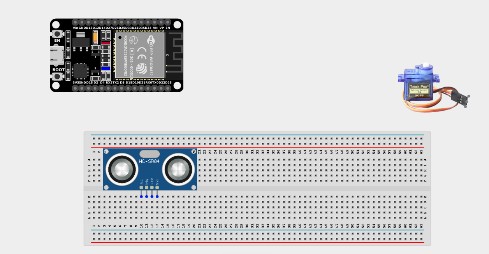
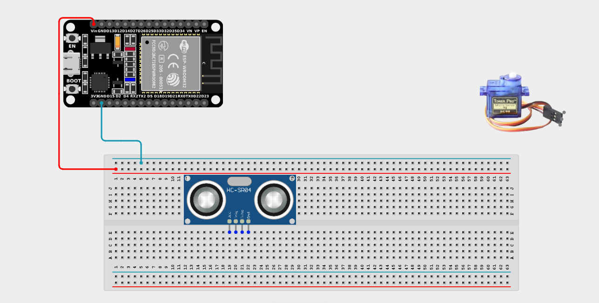
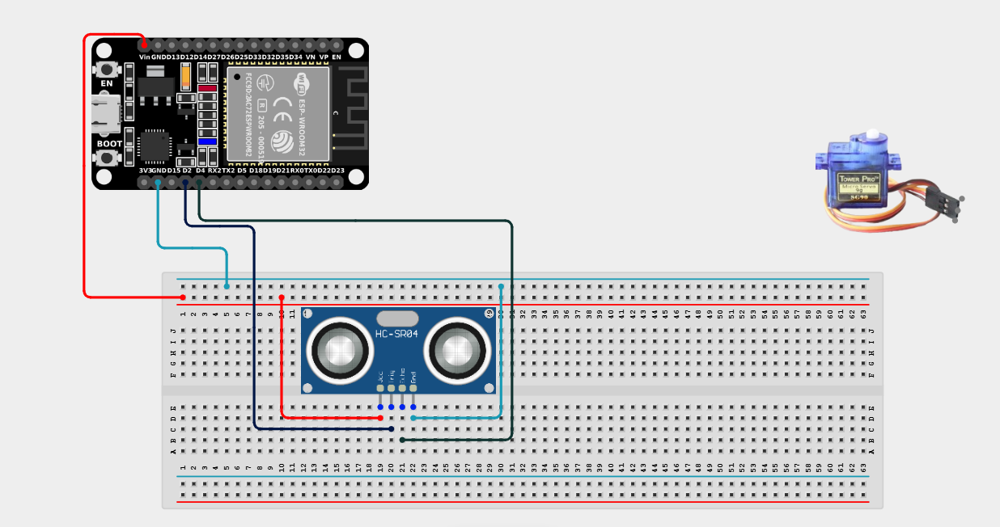
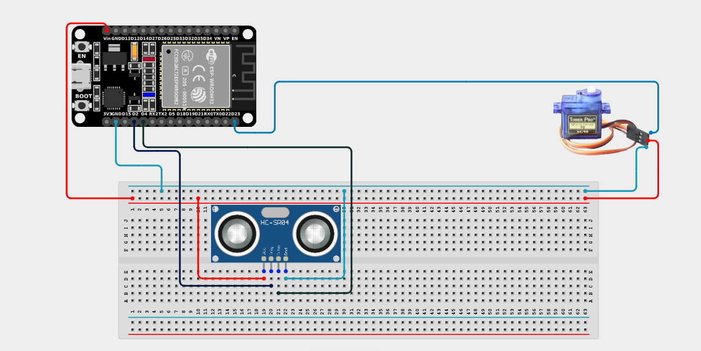

# Project 2.9.1: Servo Motor Control with Ultrasonic Sensor

| **Description** | This project demonstrates how to interface an Ultrasonic distance sensor with a Servo motor. The servo motor's shaft rotates to specific angles depending on the proximity of an object detected by the ultrasonic sensor. |
| --------------- | ---------------------------------------------------------------------------------------------------------------------------------------------------------------------------------------- |
| **Use case**    | This system forms the basis for obstacle-avoiding steering in robotics, automatic gate openers that swing open when a vehicle approaches, and visual gauge indicators.                  |

## Components (Things You will need)

|  |  |  |  |  |  |
| :--- | :--- | :--- | :--- | :--- | :--- |

## Building the circuit

> **Tip:** Use the [ESP32 Pin Mapping](../../../../assets/esp32_pin_mapping.png) image to locate the correct GPIO pins on your ESP32 board.

Things Needed:

- ESP32 board = 1

- Micro USB cable = 1

- Breadboard = 1

- Jumper wires

- HC-SR04 Ultrasonic Sensor = 1

- Servo Motor (e.g., SG90) = 1

---

## Mounting the components on the breadboard

**Step 1:** Mount the ESP32 and Components:

- Align the ESP32 board across the center dividing ridge of the breadboard.

- Insert the Ultrasonic Sensor so its four pins (VCC, TRIG, ECHO, GND) sit in separate adjacent rows.

- The Servo Motor will sit loose, connected via male-to-male jumper wires.



---

## Wiring the circuit

Follow these step-by-step connection details using your jumper wires:

**Step 1:** Create Power and Ground Rails

- Connect the **5V** or **VIN** pin on the ESP32 board to the positive (red) rail on the breadboard.

- Connect a **GND** pin on the ESP32 board to the negative (blue/black) rail on the breadboard.



**Step 2:** Wire the Ultrasonic Sensor

- Connect the **VCC** pin of the Ultrasonic sensor to the positive 5V power rail.

- Connect the **GND** pin of the Ultrasonic sensor to the negative ground rail.

- Connect the **TRIG** pin of the sensor to **GPIO 2** on the ESP32 board.

- Connect the **ECHO** pin of the sensor to **GPIO 4** on the ESP32 board.


  

**Step 3:** Wire the Servo Motor

- Connect the **GND (Brown/Black)** wire of the servo to the negative ground rail.

- Connect the **VCC (Red)** wire of the servo to the positive 5V power rail.

- Connect the **Signal (Orange/Yellow)** wire of the servo to **GPIO 23** on the ESP32 board.




*Make sure to connect the Micro USB cable securely to the ESP32 board and attach the servo blade securely.*

---

## PROGRAMMING

**Step 1:** Open your Arduino IDE. See how to set up here: [Getting Started](../../Getting Started/Arduino_IDE_Setup.md).

**Step 2:** Write the code in sections as detailed below.

### 1. Variables and Setup

```cpp
#include <ESP32Servo.h> 

const int trigPin = 2;
const int echoPin = 4;
const int servoPin = 23;

Servo myServo;

long duration;
int distance;
int servoAngle;

void setup() {
  Serial.begin(9600);

  pinMode(trigPin, OUTPUT);
  pinMode(echoPin, INPUT);

  // Attach the servo and reset to 0 degrees
  myServo.attach(servoPin);
  myServo.write(0);
  
  Serial.println("Analog Distance Gauge Online!");
}
```
*Explanation:* We import the `ESP32Servo.h` library so we can easily control the motor. We attach the servo to GPIO 23 and set its starting position to `0`. 

---

### 2. Main Loop

```cpp
void loop() {
  // 1. Send the ultrasonic pulse
  digitalWrite(trigPin, LOW);
  delayMicroseconds(2);
  digitalWrite(trigPin, HIGH);
  delayMicroseconds(10);
  digitalWrite(trigPin, LOW);

  // 2. Measure distance
  duration = pulseIn(echoPin, HIGH);
  distance = duration * 0.034 / 2;

  // 3. Constrain distance to our desired min/max ranges
  if (distance > 30) {
    distance = 30; // Max out at 30cm
  }
  if (distance < 2) {
    distance = 2; // Min out at 2cm
  }
  
  Serial.print("Distance: ");
  Serial.print(distance);
  Serial.print(" cm -> ");

  // 4. Map the distance range (2-30cm) to an angle range (180-0 degrees)
  // Close objects (2cm) = 180 degrees
  // Far objects (30cm) = 0 degrees
  servoAngle = map(distance, 2, 30, 180, 0);

  // 5. Move the servo!
  myServo.write(servoAngle);

  Serial.print("Servo Angle: ");
  Serial.println(servoAngle);

  // Delay slightly for servo movement
  delay(100);
}
```
*Explanation:* 

- We measure the distance. To prevent erratic behavior, we constrain the distance to a clean range between `2cm` and `30cm`. 

- The magic happens with the `map()` function. It takes our distance value (which is between 2 and 30) and scales it cleanly to a motor angle (between 180 and 0). 

- Notice the inversion: `2, 30` maps to `180, 0`. This means an object 2cm away results in an angle of 180 degrees. An object 30cm away results in 0 degrees.

- If you attach a needle to the servo, you have just built a physical analog gauge that shows exactly how close an object is!

---

## Uploading the code

**Step 3:** Save your code. _See the [Getting Started](../../Getting Started/Arduino_IDE_Setup.md) section_

**Step 4:** Select the ESP32 board and port _See the [Getting Started](../../Getting Started/Arduino_IDE_Setup.md) section:Selecting ESP32 board Type and Uploading your code_.

**Step 5:** Upload your code. _See the [Getting Started](../../Getting Started/Arduino_IDE_Setup.md) section:Selecting ESP32 board Type and Uploading your code_

## Conclusion

This project introduces one of the core principles of robotics and automation—using proportional sensor input (mapping continuous data) to smoothly control mechanical movement, rather than just using simple ON/OFF logic!
