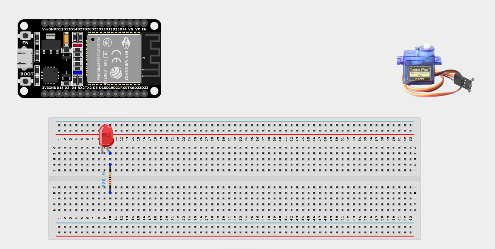
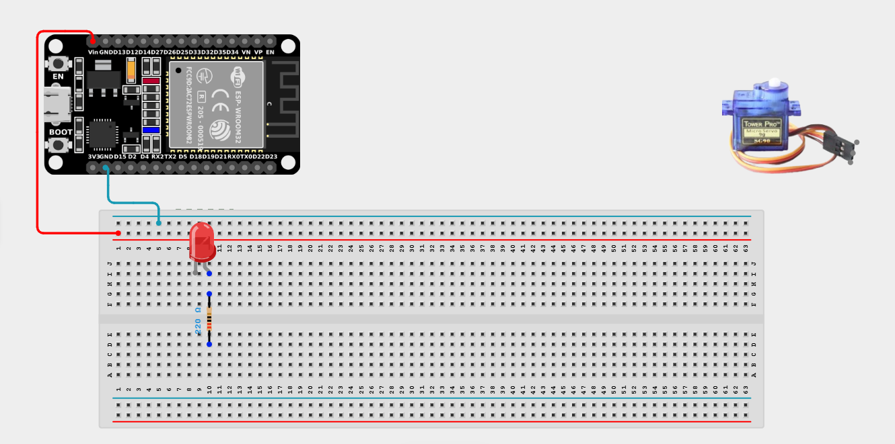
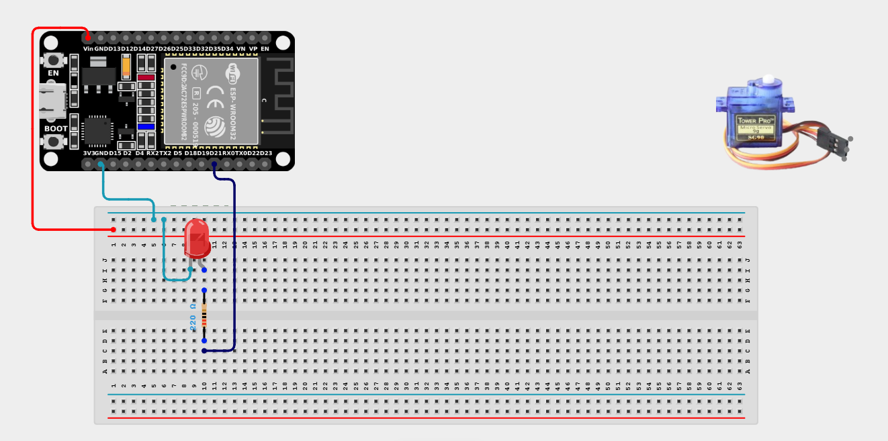
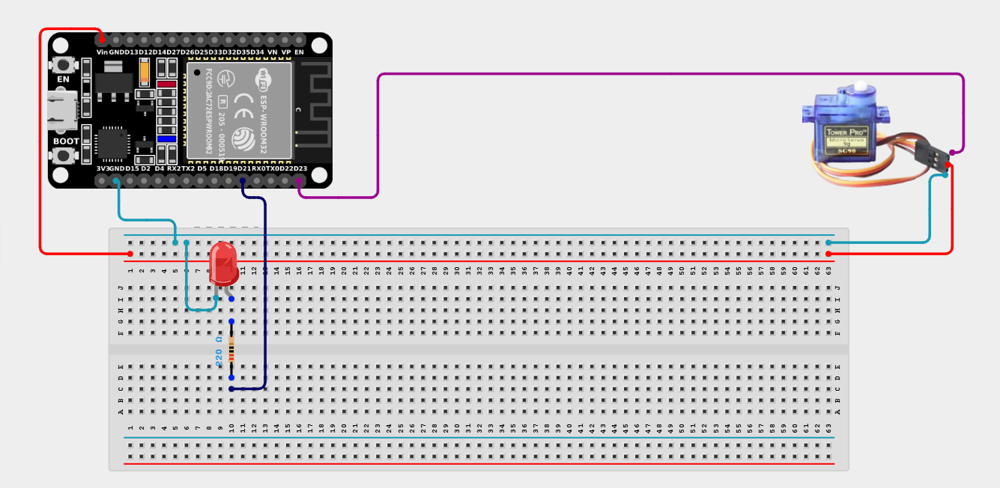

# Project 2.9.2: Moving Gate Warning Light

| **Description** | This project uses an LED that flashes only while the servo motor is actively sweeping, providing visual indication of gate movement. |
|------------------|----------------------------------------------------------------|
| **Use case**     | Used extensively in industrial safety—whenever a heavy mechanical barrier, door, or gate is in motion, warning lights flash to keep bystanders clear until the movement stops. |

## Components (Things You will need)

| | | | | | |
|-------------------------|-------------------------|-------------------------|-------------------------|-------------------------|-------------------------|

## Building the circuit

> **Tip:** Use the [ESP32 Pin Mapping](../../../../assets/esp32_pin_mapping.png) image to locate the correct GPIO pins on your ESP32 board.

Things Needed:

- ESP32 board = 1

- Micro USB cable = 1

- Breadboard = 1

- Jumper wires

- LED = 1

- 220Ω resistor = 1

- Servo motor = 1

---

## Mounting the components on the breadboard

**Step 1:** Mount the ESP32 and Components:

- Align the ESP32 board across the center dividing ridge of the breadboard.

- Insert the LED into the breadboard (remember the longer leg is positive).

- Connect the 220Ω resistor in series with the LED's positive leg.

- The Servo Motor will sit loose, connected via male-to-male jumper wires.





---

## Wiring the circuit

Follow these step-by-step connection details using your jumper wires:

**Step 1:** Create Power and Ground Rails

- Connect the **5V** or **VIN** pin on the ESP32 board to the positive (red) rail on the breadboard.

- Connect a **GND** pin on the ESP32 board to the negative (blue/black) rail on the breadboard.



**Step 2:** Wire the LED

- Connect the **positive leg** of the LED (via the resistor) to **GPIO 21** on the ESP32 board.

- Connect the **negative leg** of the LED to the negative ground rail.



**Step 3:** Wire the Servo Motor

- Connect the **GND (Brown/Black)** wire of the servo to the negative ground rail.

- Connect the **VCC (Red)** wire of the servo to the positive 5V power rail.

- Connect the **Signal (Orange/Yellow)** wire of the servo to **GPIO 23** on the ESP32 board.




*Make sure to connect the Micro USB cable securely to the ESP32 board and attach the servo blade securely.*

---

## PROGRAMMING

**Step 1:** Open your Arduino IDE. See how to set up here: [Getting Started](../../Getting Started/Arduino_IDE_Setup.md).

**Step 2:** Write the code in sections as detailed below.

### 1. Variables and Setup

```cpp
#include <ESP32Servo.h>

const int servoPin = 23;
const int ledPin = 21;

Servo gateServo;

void setup() {
  Serial.begin(9600);
  
  pinMode(ledPin, OUTPUT);
  gateServo.attach(servoPin);
  
  gateServo.write(0); // Start at 0 degrees
  digitalWrite(ledPin, LOW); // Start with light off
  
  Serial.println("Gate initialized and closed.");
}
```
*Explanation:* We import the `ESP32Servo.h` library to control the motor. We initialize the LED and ensure the gate starts in a closed (`0`) position with the warning light off.

---

### 2. Main Loop

```cpp
void loop() {
  Serial.println(">>> Opening Gate...");
  
  // Sweep from 0 to 180 degrees
  for (int angle = 0; angle <= 180; angle++) {
    gateServo.write(angle);
    
    // Flash the LED very quickly as it moves
    digitalWrite(ledPin, HIGH);
    delay(10);
    digitalWrite(ledPin, LOW);
    delay(10); 
  }
  
  Serial.println("Gate is OPEN. Holding for 1 second.");
  // Make sure the LED stays OFF when not moving
  digitalWrite(ledPin, LOW);
  delay(1000); 
  
  Serial.println(">>> Closing Gate...");
  // Sweep from 180 back to 0 degrees
  for (int angle = 180; angle >= 0; angle--) {
    gateServo.write(angle);
    
    // Flash the LED very quickly as it moves
    digitalWrite(ledPin, HIGH);
    delay(10);
    digitalWrite(ledPin, LOW);
    delay(10); 
  }
  
  Serial.println("Gate is CLOSED. Holding for 1 second.");
  digitalWrite(ledPin, LOW);
  delay(1000);
}
```
*Explanation:* 

- We use a `for` loop to increment the `angle` of the servo smoothly from 0 to 180.

- Inside that `for` loop, we rapidly pulse the `ledPin` HIGH and LOW. Because this is inside the loop driving the servo, the LED flashes *perfectly in sync* with the physical movement!

- Once the `for` loop ends (the gate is fully open or closed), the LED is forced LOW and the program pauses for a second before reversing direction.

---

## Uploading the code

**Step 3:** Save your code. _See the [Getting Started](../../Getting Started/Arduino_IDE_Setup.md) section_

**Step 4:** Select the ESP32 board and port _See the [Getting Started](../../Getting Started/Arduino_IDE_Setup.md) section:Selecting ESP32 board Type and Uploading your code_.

**Step 5:** Upload your code. _See the [Getting Started](../../Getting Started/Arduino_IDE_Setup.md) section:Selecting ESP32 board Type and Uploading your code_

## Conclusion

This project helps you understand how you can interleave logic commands (flashing an LED) directly inside a motor control loop to guarantee that an alert system perfectly matches a physical action in real time!
