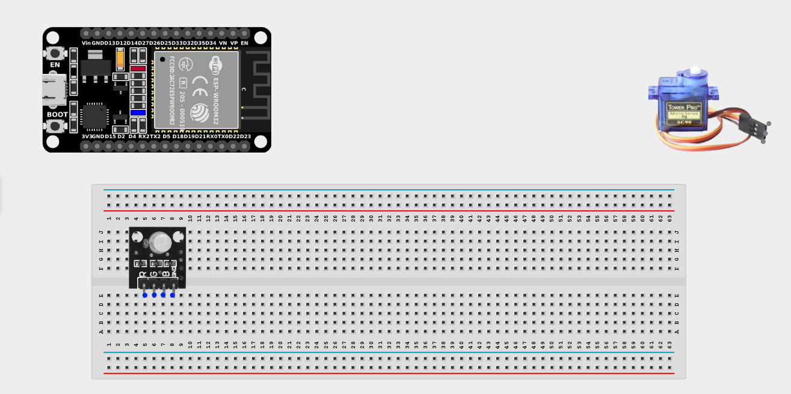
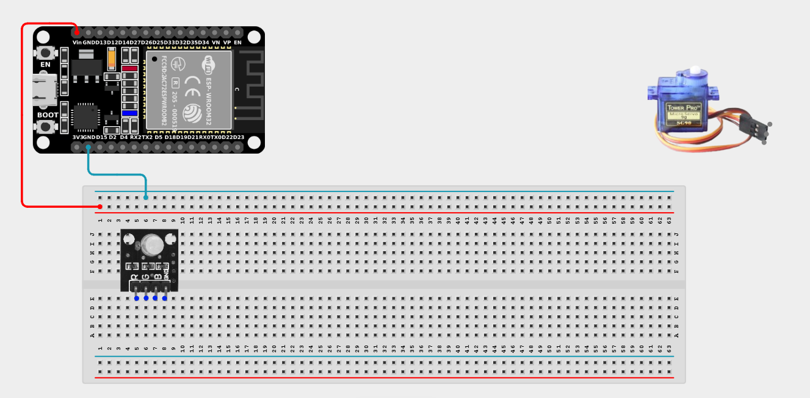
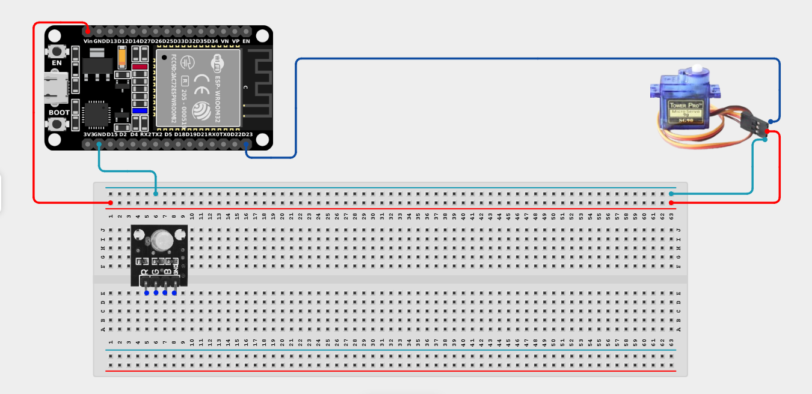
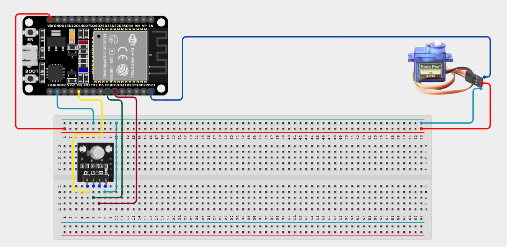

# Project 2.9.3: Mechanical Expression Display

| **Description** | This project makes a servo motor rotate a simulated robot head while the RGB LED changes eye colors for expressive effects. |
|------------------|----------------------------------------------------------------|
| **Use case**     | Used in educational robotics, interactive exhibits, and robotic companions to simulate expressive body language and changing emotional states for enhanced human-robot interaction. |

## Components (Things You will need)

| | | | | | |
|-------------------------|-------------------------|-------------------------|-------------------------|-------------------------|-------------------------|

## Building the circuit

> **Tip:** Use the [ESP32 Pin Mapping](../../../../assets/esp32_pin_mapping.png) image to locate the correct GPIO pins on your ESP32 board.

Things Needed:

- ESP32 board = 1

- Micro USB cable = 1

- Breadboard = 1

- Jumper wires

- RGB LED module = 1

- Servo motor = 1

---

## Mounting the components on the breadboard

**Step 1:** Mount the ESP32 and Components:

- Align the ESP32 board across the center dividing ridge of the breadboard.

- Insert the RGB LED Module into the breadboard so its four pins sit in separate adjacent rows.

- The Servo Motor will sit loose, connected via male-to-male jumper wires.



---

## Wiring the circuit

Follow these step-by-step connection details using your jumper wires:

**Step 1:** Create Power and Ground Rails

- Connect the **5V** or **VIN** pin on the ESP32 board to the positive (red) rail on the breadboard.

- Connect a **GND** pin on the ESP32 board to the negative (blue/black) rail on the breadboard.



**Step 2:** Wire the Servo Motor

- Connect the **GND (Brown/Black)** wire of the servo to the negative ground rail.

- Connect the **VCC (Red)** wire of the servo to the positive 5V power rail.

- Connect the **Signal (Orange/Yellow)** wire of the servo to **GPIO 23** on the ESP32 board.



**Step 3:** Wire the RGB LED

- Connect the **GND** pin (usually the longest leg) of the RGB LED to the negative ground rail.

- Connect the **Red (R)** pin of the RGB LED to **GPIO 4** on the ESP32 board.

- Connect the **Green (G)** pin of the RGB LED to **GPIO 18** on the ESP32 board.

- Connect the **Blue (B)** pin of the RGB LED to **GPIO 19** on the ESP32 board.




*Make sure to connect the Micro USB cable securely to the ESP32 board and your computer.*

---

## PROGRAMMING

**Step 1:** Open your Arduino IDE. See how to set up here: [Getting Started](../../Getting Started/Arduino_IDE_Setup.md).

**Step 2:** Write the code in sections as detailed below.

### 1. Variables and Setup

```cpp
#include <ESP32Servo.h>

const int servoPin = 23;

const int redPin = 4;
const int greenPin = 18;
const int bluePin = 19;

Servo robotHead;

void setup() {
  Serial.begin(9600);
  
  robotHead.attach(servoPin);
  
  pinMode(redPin, OUTPUT);
  pinMode(greenPin, OUTPUT);
  pinMode(bluePin, OUTPUT);
  
  // Look straight ahead (90 degrees) to start
  robotHead.write(90);
  Serial.println("Robot initialized.");
}
```
*Explanation:* We import `ESP32Servo.h` to run the motor, map out all our pins, and attach the servo, setting its default position to "center" (`90`).

---

### 2. Main Loop and Helper Function

```cpp
void loop() {
  // --- BEHAVIOR 1: Look Right + Blue Eyes ---
  setColor(0, 0, 255); // Blue
  Serial.println("Looking Right...");
  for (int angle = 90; angle >= 0; angle--) {
    robotHead.write(angle);
    delay(15); 
  }
  delay(500);
  
  // --- BEHAVIOR 2: Sweep Left + Green Eyes ---
  setColor(0, 255, 0); // Green
  Serial.println("Sweeping Left...");
  for (int angle = 0; angle <= 180; angle++) {
    robotHead.write(angle);
    delay(15); 
  }
  delay(500);
  
  // --- BEHAVIOR 3: Return to Center + Red Eyes ---
  setColor(255, 0, 0); // Red
  Serial.println("Returning to Center...");
  for (int angle = 180; angle >= 90; angle--) {
    robotHead.write(angle);
    delay(15); 
  }
  delay(1000); // Wait a second before repeating the sequence
}

// Custom Helper Function to set RGB colors
void setColor(int red, int green, int blue) {
  analogWrite(redPin, red);
  analogWrite(greenPin, green);
  analogWrite(bluePin, blue);
}
```
*Explanation:* 

- We break the robot's movement into 3 distinct "behaviors".

- For each behavior, we use our custom `setColor()` function to instantly change the LED color. 

- Immediately after changing color, a `for` loop smoothly rotates the servo to a new position.

- This creates the illusion of an animated character looking around its environment!

---

## Uploading the code

**Step 3:** Save your code. _See the [Getting Started](../../Getting Started/Arduino_IDE_Setup.md) section_

**Step 4:** Select the ESP32 board and port _See the [Getting Started](../../Getting Started/Arduino_IDE_Setup.md) section:Selecting ESP32 board Type and Uploading your code_.

**Step 5:** Upload your code. _See the [Getting Started](../../Getting Started/Arduino_IDE_Setup.md) section:Selecting ESP32 board Type and Uploading your code_

## Conclusion

This project helps you understand how combining synchronized color shifts and mechanical movements can create lifelike, expressive behaviors in simple robots!
