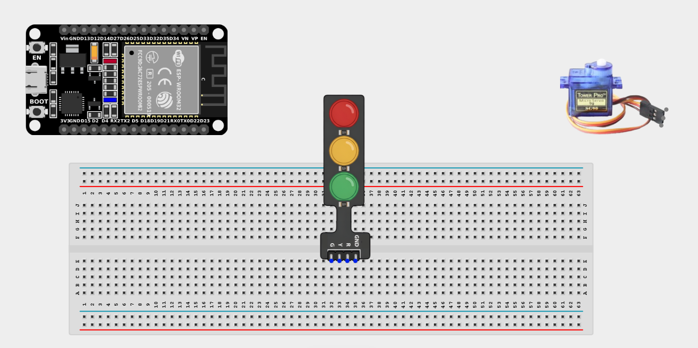
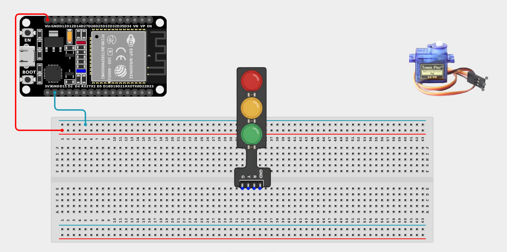
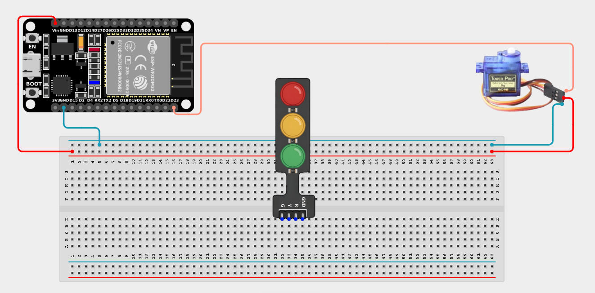
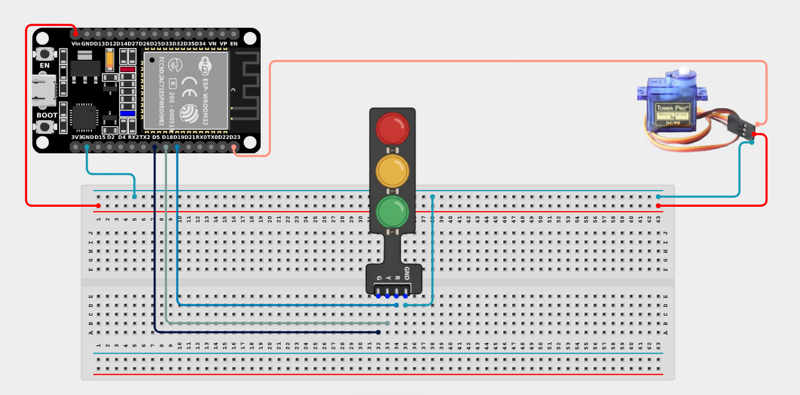

# Project 2.9.4: Traffic Barrier Gate

| **Description** | This project controls a servo barrier that opens when the Traffic Light shows Green and closes when it shows Red, simulating a railway crossing. |
|------------------|----------------------------------------------------------------|
| **Use case**     | Used in railway crossing simulations, automated toll gates, parking access control, and traffic management systems, where a physical barrier must synchronize perfectly with a visual traffic signal. |

## Components (Things You will need)

| | | | | | |
|-------------------------|-------------------------|-------------------------|-------------------------|-------------------------|-------------------------|

## Building the circuit

> **Tip:** Use the [ESP32 Pin Mapping](../../../../assets/esp32_pin_mapping.png) image to locate the correct GPIO pins on your ESP32 board.

Things Needed:

- ESP32 board = 1

- Micro USB cable = 1

- Breadboard = 1

- Jumper wires 

- Traffic light module = 1

- Servo motor = 1

---

## Mounting the components on the breadboard

**Step 1:** Mount the ESP32 and Components:

- Align the ESP32 board across the center dividing ridge of the breadboard.

- Insert the Traffic Light Module into the breadboard so its four pins (G, Y, R, GND) sit in separate adjacent rows.

- The Servo Motor will sit loose, connected via male-to-male jumper wires.



---

## Wiring the circuit

Follow these step-by-step connection details using your jumper wires:

**Step 1:** Create Power and Ground Rails

- Connect the **5V** or **VIN** pin on the ESP32 board to the positive (red) rail on the breadboard.

- Connect a **GND** pin on the ESP32 board to the negative (blue/black) rail on the breadboard.



**Step 2:** Wire the Servo Motor

- Connect the **GND (Brown/Black)** wire of the servo to the negative ground rail.

- Connect the **VCC (Red)** wire of the servo to the positive 5V power rail.

- Connect the **Signal (Orange/Yellow)** wire of the servo to **GPIO 23** on the ESP32 board.



**Step 3:** Wire the Traffic Light Module

- Connect the **GND** pin of the traffic light to the negative ground rail.

- Connect the **Green (G)** pin of the traffic light to **GPIO 5** on the ESP32 board.

- Connect the **Yellow (Y)** pin of the traffic light to **GPIO 18** on the ESP32 board.

- Connect the **Red (R)** pin of the traffic light to **GPIO 19** on the ESP32 board.



*Make sure to connect the Micro USB cable securely to the ESP32 board and attach the servo blade securely.*

---

## PROGRAMMING

**Step 1:** Open your Arduino IDE. See how to set up here: [Getting Started](../../Getting Started/Arduino_IDE_Setup.md).

**Step 2:** Write the code in sections as detailed below.

### 1. Variables and Setup

```cpp
#include <ESP32Servo.h>

const int greenLED = 5;
const int yellowLED = 18;
const int redLED = 19;

const int servoPin = 23;
Servo barrier;

void setup() {
  Serial.begin(9600);
  
  pinMode(greenLED, OUTPUT);
  pinMode(yellowLED, OUTPUT);
  pinMode(redLED, OUTPUT);
  
  barrier.attach(servoPin);
  barrier.write(0); // Start with the barrier down (0 degrees)
  
  Serial.println("Traffic Gate System Initialized.");
}
```
*Explanation:* We configure our traffic light pins as `OUTPUT`s and set up our Servo motor on `GPIO 23`, ensuring the gate starts in the closed position (`0` degrees).

---

### 2. Main Loop

```cpp
void loop() {
  // --- Phase 1: GREEN LIGHT / GATE OPEN ---
  Serial.println("GO! Gate is OPEN.");
  digitalWrite(greenLED, HIGH);
  digitalWrite(yellowLED, LOW);
  digitalWrite(redLED, LOW);
  barrier.write(90); // Lift barrier
  delay(5000);       // Stay open for 5 seconds
  
  // --- Phase 2: YELLOW LIGHT / GATE CLOSING SOON ---
  Serial.println("CAUTION! Gate closing soon...");
  digitalWrite(greenLED, LOW);
  digitalWrite(yellowLED, HIGH);
  digitalWrite(redLED, LOW);
  // Keep barrier up during yellow!
  delay(2000);       // Show yellow for 2 seconds
  
  // --- Phase 3: RED LIGHT / GATE CLOSED ---
  Serial.println("STOP! Gate is CLOSED.");
  digitalWrite(greenLED, LOW);
  digitalWrite(yellowLED, LOW);
  digitalWrite(redLED, HIGH);
  barrier.write(0);  // Drop barrier
  delay(5000);       // Stay closed for 5 seconds
}
```
*Explanation:* 

- We sequence the traffic light and motor movements together using `delays`.

- **Green phase:** The gate is lifted (`90` degrees) and cars can pass for 5 seconds.

- **Yellow phase:** The light turns yellow. The gate *stays* open, but warns drivers it is about to close.

- **Red phase:** The light turns red, and the gate simultaneously drops (`0` degrees), blocking traffic for 5 seconds!

---

## Uploading the code

**Step 3:** Save your code. _See the [Getting Started](../../Getting Started/Arduino_IDE_Setup.md) section_

**Step 4:** Select the ESP32 board and port _See the [Getting Started](../../Getting Started/Arduino_IDE_Setup.md) section:Selecting ESP32 board Type and Uploading your code_.

**Step 5:** Upload your code. _See the [Getting Started](../../Getting Started/Arduino_IDE_Setup.md) section:Selecting ESP32 board Type and Uploading your code_

## Conclusion

This project teaches you how to map sequential logic across completely different types of outputs—syncing a visual cue perfectly with a mechanical action!
