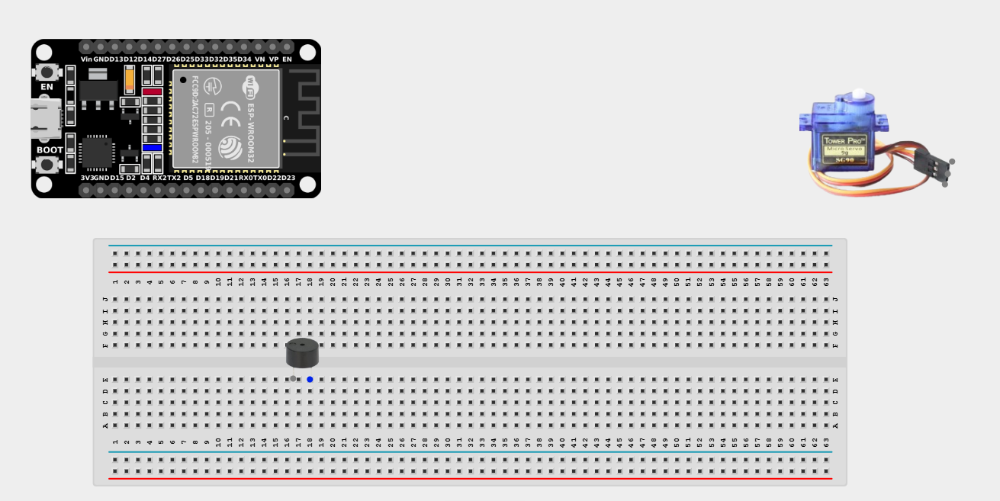
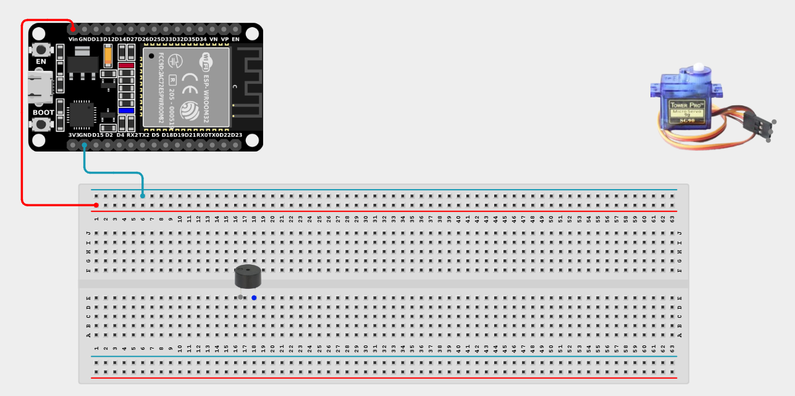
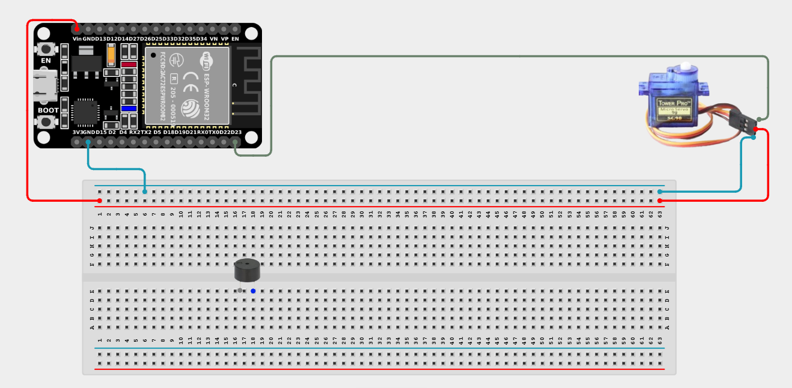
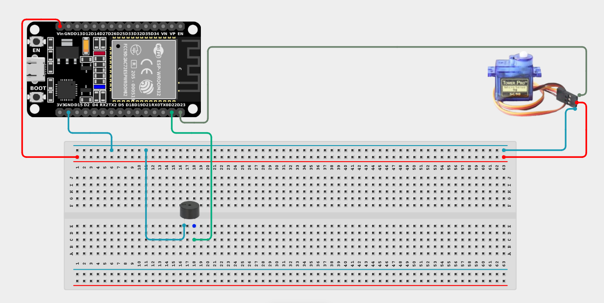

# Project 2.9.5: Chiming Sweep Display

| **Description** | This project makes a servo sweep back and forth while the buzzer emits a chime sound at each limit position. |
|------------------|----------------------------------------------------------------|
| **Use case**     | Used in automated gates, robotic arms, interactive exhibits, and industrial machinery to provide audible feedback whenever a moving mechanism hits its absolute physical limits. |

## Components (Things You will need)

| | | | | | |
|-------------------------|-------------------------|-------------------------|-------------------------|-------------------------|-------------------------|

## Building the circuit

> **Tip:** Use the [ESP32 Pin Mapping](../../../../assets/esp32_pin_mapping.png) image to locate the correct GPIO pins on your ESP32 board.

Things Needed:

- ESP32 board = 1

- Micro USB cable = 1

- Breadboard = 1

- Jumper wires 

- Buzzer = 1

- Servo motor = 1

---

## Mounting the components on the breadboard

**Step 1:** Mount the ESP32 and Components:

- Align the ESP32 board across the center dividing ridge of the breadboard.

- Insert the Buzzer into the breadboard (remember the longer leg is positive).

- The Servo Motor will sit loose, connected via male-to-male jumper wires.



---

## Wiring the circuit

Follow these step-by-step connection details using your jumper wires:

**Step 1:** Create Power and Ground Rails

- Connect the **5V** or **VIN** pin on the ESP32 board to the positive (red) rail on the breadboard.

- Connect a **GND** pin on the ESP32 board to the negative (blue/black) rail on the breadboard.



**Step 2:** Wire the Servo Motor

- Connect the **GND (Brown/Black)** wire of the servo to the negative ground rail.

- Connect the **VCC (Red)** wire of the servo to the positive 5V power rail.

- Connect the **Signal (Orange/Yellow)** wire of the servo to **GPIO 23** on the ESP32 board.



**Step 3:** Wire the Buzzer

- Connect the **positive pin (longer leg)** of the Buzzer to **GPIO 22** on the ESP32 board.

- Connect the **negative pin (shorter leg)** of the Buzzer to the negative ground rail.



*Make sure to connect the Micro USB cable securely to the ESP32 board and attach the servo blade securely.*

---

## PROGRAMMING

**Step 1:** Open your Arduino IDE. See how to set up here: [Getting Started](../../Getting Started/Arduino_IDE_Setup.md).

**Step 2:** Write the code in sections as detailed below.

### 1. Variables and Setup

```cpp
#include <ESP32Servo.h>

const int servoPin = 23;
const int buzzerPin = 22;

Servo myServo;

void setup() {
  Serial.begin(9600);
  
  myServo.attach(servoPin);
  pinMode(buzzerPin, OUTPUT);
  
  myServo.write(0); // Start at home position
  Serial.println("Sweep system armed.");
}
```
*Explanation:* We import the `ESP32Servo.h` library, attach the servo, and define our buzzer pin. 

---

### 2. Main Loop and Helper Function

```cpp
void loop() {
  Serial.println("Sweeping Outward...");
  // Sweep from 0 to 180 degrees
  for (int angle = 0; angle <= 180; angle++) {
    myServo.write(angle);
    delay(15);
  }
  
  // Reached limit! Play chime.
  Serial.println("Limit Reached!");
  playChime();
  delay(500);
  
  Serial.println("Sweeping Return...");
  // Sweep from 180 back to 0 degrees
  for (int angle = 180; angle >= 0; angle--) {
    myServo.write(angle);
    delay(15);
  }
  
  // Reached limit! Play chime.
  Serial.println("Limit Reached!");
  playChime();
  delay(500);
}

// Custom Helper Function to play a two-tone "ding-dong" chime
void playChime() {
  tone(buzzerPin, 1000); // 1000 Hz tone
  delay(150);
  tone(buzzerPin, 1500); // Higher 1500 Hz tone
  delay(150);
  noTone(buzzerPin);     // Silence
}
```
*Explanation:* 

- We use a custom `playChime()` function that quickly plays a two-tone "ding-dong" sound by running `tone()` at 1000Hz, delaying slightly, and then running `tone()` at 1500Hz. 

- In the `loop()`, a `for` loop smoothly sweeps the servo to 180 degrees. Once the loop ends, the servo is at its limit, and we execute `playChime()`.

- The system then sweeps back to 0 degrees using another `for` loop, and plays the chime again when it arrives home!

---

## Uploading the code

**Step 3:** Save your code. _See the [Getting Started](../../Getting Started/Arduino_IDE_Setup.md) section_

**Step 4:** Select the ESP32 board and port _See the [Getting Started](../../Getting Started/Arduino_IDE_Setup.md) section:Selecting ESP32 board Type and Uploading your code_.

**Step 5:** Upload your code. _See the [Getting Started](../../Getting Started/Arduino_IDE_Setup.md) section:Selecting ESP32 board Type and Uploading your code_

## Conclusion

This project demonstrates how you can modularize your code using custom functions (`playChime()`), making your main loop extremely clean and easy to read!
